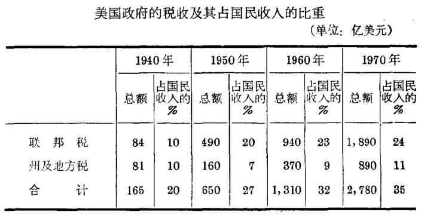
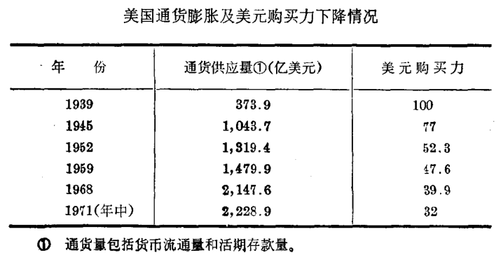
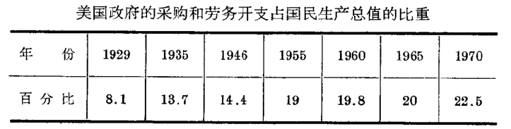
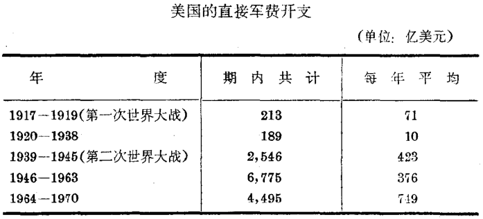

# 凯恩斯的救治方案


根据上面的分析，凯恩斯的全部就业理论是彻头彻尾唯心主义的，完全出于无耻的捏造。列宁说：“[政治经济学教授（指资产阶级的一一引者注）虽然在实际材料的专门研究方面能够写出极有价值的作品，可是一旦说到政治经济学的一般理论时，他们中间任何一个人所说的任何一句话都不可相信](https://www.marxists.org/chinese/lenin-cworks/18/007.htm)。”凯恩斯为什么要用这种欺骗手段，故弄玄虚大发谬论呢？目的很清楚，**就是企图否定马克思关于社会发展规律的学说**，证明资本主义的前景还是十分美妙的，只要国家干涉经济，资本主义就可以成为尽善尽美的制度了。在他看来，就业量决定于有效需求，有效需求又分为两部分：消费需求与投资需求；同时，由于资本主义并不是一个能自动调节以达到充分就业的制度，而且国家愈富，“消费不足”和“投资不足”的情形就愈严重。因此他**主张政府采取行动，干涉经济生活来消灭经济危机和失业**。他写道：政府职能的扩大，以便负起责任来提高消费的能力与促进投资的活动，这是避免现行经济形态整个毁灭的唯一途径。凯恩斯就业理论的中心思想就是这样。


\
从这一幻想出发，凯恩斯提出了一套经济纲领，作为对付危机和失业的“新”方案。这一套纲领强调依靠国家对资本主
义经济进行直接干预，而这一点，正是同庸俗经济学派显著的不同之处。英美资产阶级经济学的旧传统一般认为，只有听任资本主义市场经济自发调节，才能保证资本主义经济的顺利运行。而凯恩斯及其信徒，一贯**鼓吹扩大资产阶级政府的职能，以便对社会经济生活进行更广泛和更直接的干预**。正由于凯恩斯分子极力主张国家干预经济并为之制造出“理论” 依据，因而凯恩斯主义时常被称为**国家垄断资本主义**的“理论基础。


\
凯恩斯的国家干预概括说来，有以下三项：

* 通过赋税政策，实行国民收入再分配；
* 加强通货管理以降低利息，刺激新的投资；
* “投资社会化”，这又包括两个方面：管理私人投资以限制私人投资的波动：利用公共投资以增加经济活动和弥补私人投资的不足。前一项纲领在于提高消费，后两项纲领在于增加投资。

除此以外，他还主张实行对外扩张政策，以便转嫁危机和解决本国失业等问题。这套纲领行得通吗？我们倒要仔细研究一下这个问题。

***

## 赋税政策与收入再分配



在铁的事实面前，凯恩斯不得不承认，现代资本主义社会具有一个显著的缺点，即财富与收入的分配太不平均。他认为，消费支出的不足，是由于收入分配不均的趋向所造成的。因为，如果把国民收入的较大部分交给那些需要已经得到充分满足的人，他们只会把收入的一小部分用于消费，而把大部分储蓄起来，结果就造成商品的滞销和失业的增长。所以，只有把国民收入的大部分交给低收入的家庭，他们会把收入大量花掉，这样便能提高消费的支出，扩大社会需求的总量。于是他提出了一个冠冕堂皇的主张，即用累进税来缩小收入分配不均的幅度，以增加消费和提高就业水平。


\
的确，在资本主义社会里，财富与收入的分配，是个非常
尖锐的问题。凯恩斯提出赋税政策的自的，果真是要改变资本主义的分配关系吗？赋税政策到底能否实现收入再分配以消除财富分配不均的现象呢？这是问题的中心。


\
首先应该指出，离开资本主义的生产关系来处理财富及
收入的分配问题，那是欺人之谈。马克思写道：“[消费资料的任何一种分配，都不过是生产条件本身分配的结果。而生产条件的分配，则表现生产方式本身的性质。例如，资本主义生产方式的基础就在于：物质的生产条件以资本和地产的形式掌握在非劳动者的手中，而人民大众则只有人身的生产条件，即劳动力。既然生产的要素是这样分配的，那未自然而然地就要产生消费资料的现在这样的分配。如果物质的生产条件是劳动者自己的集体财产，那未同样要产生一种和现在不同的消费资料的分配。](https://www.marxists.org/chinese/marx-engels2/03/17.htm)”这是颠扑不破的真理。因为<mark style="color:blue;">分配关系是生产关系的一个重要方面，它是由生产资料所有制和人们在生产中的相互关系的性质所决定的</mark>。**在资本主义制度下，由于生产资料的资本主义所有制占着统治地位，国民收入的分配必然服从于资本主义基本经济规律的要求，使其有利于资产阶级而不利于工人阶级和其他一切劳动人民。因此，在资本主义私有制的基础上，企图通过收入再分配来消灭收入不均的现象是绝对不可能的事情。**


\
&#x20;因此凯恩斯宣扬的所谓收入再分配，完全是一种蛊惑人心的宣传。非常明显，**赋税政策不能改变以资本主义生产方式为基础的分配关系，相反的，它只能引起劳动者生活状况的进一步恶化**。<mark style="color:blue;">这是因为税收制度的社会性质和实际效果，完全决定于社会的经济结构以及国家政权的性质。在资本主义条件下，税收制度是巩固资产阶级政权的工具</mark>。英、美及其他资本主义国家所实行的税收政策便是有力的证明。例如美国在1789一1945年的 156 年当中，联邦政府一共征收了2,540 亿美元的税款，而在第二次世界大战结束后的8年（1946一 1953年）当中，政府就向居民征收了3，920亿美元，即比以前156年所收的税款总额还要多1，380亿美元。据美国商务部公布的资料，从1940年至1970年30年间，美国的赋税增加了近16倍，即从 1940年的165亿美元增至1970 年的 2，780亿美元。按人口平均分摊，1948年每人负担377美元，到1970年已增加到1，500美元，在22年中增加了3倍。同时，赋税的重担也越来越多地转嫁到收入最低的劳动人民身上。这可以用下列资料来说明。


\

<figure><figcaption></figcaption></figure>


\
从美国税收的具体项目来看，美国联邦政府财政收入几
乎五分之四来自个人所得税、社会保险信托基金和消费税。这三项税收绝大部分是由一般职工负担的，而公司所得税仅占税收总额的五分之一，最近几年下降到六分之一左右。


如果考到农民及其他劳动者所缴纳的各种赋税，那就
更能明显地看出美国的税收已经成为掠夺广大居民阶层的工具了。


现在，一些社会民主党人还利用凯恩斯主义这虚伪的
纲领进行投机活动，大力宣传通过税收达到“收入均等”，并通过“收入均等”走向社会主义，这就是所谓“赋税的社会主义” ，但是右翼工党分子的实践，正好是对社会民主党人标榜的所谓“赋税的社会主义”的最有力的反驳。英国工党在执政期间非但没有把税收负担加以比较公平地分配，反而大大增加了工人和职员的捐税负担。例如英国工人的所得税从1938年的200万英镑增加到1950一1951年度的21,200万英镑，即增加了105倍，而资产阶级集团的所得税在同一时期却只增加了不到3倍。劳动人民的赋税负担不断加重，而资本家的利润却不断在增长。不仅如此，工党政府还把战时抽100% 的超额利润税减低到80%，一年后又减低到60%。**这表明工党的“社会主义”纯粹是替垄断组织服务的伪装**。


\
上述资料彻底揭穿了凯恩斯主义者关于利用赋税政策“公平地分配收入”的谬论。然而资产阶级经济学家硬说，近二、三十年来，国民收入的分配，似乎是比较平均了，甚至胡说什么“收入革命”。关于所谓“收入革命”的论调，我们毋须多费笔墨来详加评论，事实是不难看到的，这里就有一个关于美
国各种形式收入变动的统计：&#x20;



<figure><figcaption></figcaption></figure>

上表证明：在1929-1967年期间，公司利润增加了7倍，
私人企业中的工资和薪金总额只增加了6.4倍，农民收入只增加了1.8倍。所以在国民收入中，资本家所占的份额上升了，而工人和农民所占的份额则下降了。近一、二十年来，美国贫富两极化的情形更加严重。据美国密执安大学调查研究中心的资料，1970年，美国最富有的5%的家庭占有全部社会财富的40%以上，而处于社会底层的50%的家庭约只占全部社会财富的 3%左右。另据宾夕法尼亚州立大学的詹姆斯：史密斯研究估计，在美国成年人中最富有的1%的人拥有一万亿美元财富，占全国私人资产的25%以上。从股票掌握的情况来看，剑桥研究院的乌赖和利安两人的研究报告指出，在 1962年，20%的富翁拥有全部公司股票的97%，而其中最富有的1%的大富翁则掌握全部公司股票的62%。美国《商业周刊》指出：“这些研究结果清楚地表明，在最富和最穷的美国人之间距离正在继续扩大。”《纽约时报》也说：“在美国，收入的分配存在着惊人的持续的不均状况，而这些状况实际上是第二次世界大战以来直没有改变的。”


就英国来讲，从1946一1950年工党执政期间，资产阶级

在国民收入中所占的份额从32%增加到35%（税收除外，没有分配的利润计算在内），而工人阶级所占的份额却从47% 降低到43%。


现代资本主义的实际情况完全推翻了所谓“收入革命”或“公平分配收入”的蛊惑宣传。列宁早已揭露了“公平分配收入”的虚伪性。他写道：“[资本主义就是生产资料的私有制和生产的无政府状态。鼓吹在这种基础上“公平’分配收入，便是蒲鲁东主义，便是市偿和人的痴想。只能“按实力大小来瓜分。](https://www.marxists.org/chinese/lenin-cworks/26/044.htm)”①


\
当然，许多凯恩斯主义者环绕分配问题所进行的叫嚣，与蒲鲁东式的幻想是不同的，他们所着重的是问题的另一面。十多年前，美国两个经济学家合写了一本叫《资本家宣言》的书，提出一种骇人听闻的怪论。他们说：造成美国经济困难的根本原因是“社会分配的不公平性”，而这种分配的不公平性是由于工人阶级“掠夺和剥削了”资本家，一部分理应属于资本家的财富，却落到工人的腰包里去了。因此他们号召来一次“改变资本主义分配形式的革命”。这种赤裸裸的宣传品，道破了一切垄断资本辩护士关于收入再分配的实质。


\
还应指出，凯恩斯分子在谈到赋税制度的演变时，还极力吹嘘它的“稳定”作用，说什么美国通过长期的税制改革，赋税已成为极重要的“自动稳定器”，这种“自动稳定器”是反商业循环的有力武器。由于现在所得税（个人所得税与公司所得税)占到联邦政府收入的三分之二以上，而所得税的收入是随国民收入的上升而自动增加，随它的下降而自动减少，这就使

国民收入的循环性下降对于社会总支出的影响减少了，从而资本主义经济可以保持长久的稳定。美国经济学会在一篇报告中写道：“我们对1949年联邦财政制度的稳定作用可作如下的总结：在没有国会或行政首领的抵销行动下，国民收入每降低100亿元，税收就会随之下降约30亿元，···同样，国民收入每上升100亿元，税收就会随之增加约30亿元，许多经济学者认为，自动调节器的进一步扩大是可能的，而且是好的。”


\
尽管不少凯恩斯分子大肆宣扬赋税的稳定作用，但是实际生活表明，资本主义经济随着赋税的日益增加而变得愈来愈不稳定了。在现实的打击之下，一些资产阶级学者不得不供认，这种自动稳定器的作用有限，不足以“熨平”资本主义的经济波动。于是他们的注意力就集中到金融政策与财政政策方面来了。

***

## 金融政策与工资政策


\

凯恩斯的经济纲领是着重在投资方面的。为了刺激私人投资，他主张政府增加货币数量、降低利息，并坚定地认为低利政策是刺激投资和防止失业的一个最重要的条件。他写到：“设货币可以象农作物一样生长，或象汽车一样制造，则不景气可以避免或减少。”（就业、利息和货币通论》）在资本主义经济中，**增加货币数量就可以降低利息率吗？降低利息率就可以刺激投资吗？**&#x4E0B;面我们就来谈谈这两个问题。


\
首先，我们曾经指出，<mark style="color:blue;">利息率的水平并不决定于货币数
量，而是由借贷资本的供求关系来决定的，特别是由现行利润
率的高低来决定的。因为利息本身只是利润的一部分，在通常条件下，借贷资本的利息率不能超过平均利润率，否则向别人借用资本就失掉任何意义了。</mark>凯恩斯用货币的范畴代替了借贷资本的范畴，竟认为在一般情况下，货币数量对于利息率具有决定性的影响。这一论断是反科学的。事实上，**借贷资本和货币是完全不同的两个概念**。借贷资本不但与正在流通中的货币不同，而且是独立存在的；社会上货币数量的增减和借贷资本的增减，未必有直接的联系。假如一万元货币由甲存入银行，再由银行贷与乙，乙把此款借与丙，而丙又把此款存入银行，然后再由银行贷与丁，如果在一日之间，这样反复贷放五次，那末一万元的货币便能产生五万元的借贷资本。因此，**同一枚货币可以反复地作为借贷资本**。但同一货币数量转变为借贷资本的可能性，却取决于一系列的因素，如信用制度的发展，商品的流转速度和一般的经济情况等。同时，其中每一个因素都可以随时改变。当货币数量增加时，可以因信用联系的恶化和现金贮藏的增多而对借贷资本的数量变动不发生作用。**所以货币数量的增减不定会使借贷资本的供给发生相应的变化**。例如在萧条时期，通货收缩，但借贷资本的供给有时反会增加。因此，货币和借贷资本是两个完全不同的范畴，根本不能混为一谈。**而且利息率的高低也不依存于货币的数量**。马克思写道：“[通货的绝对量只有在货币紧急的时期，方才对利息率有决定的影响”，“如果情形不是这样,通货的绝对量对利息率就不会有什么影响；……。](https://www.marxists.org/chinese/marx-engels/25/032.htm)”凯恩
斯企图通过货币数量来调节利息率，这是不可能的幻想。


\
其次，**利息率的高低也不能决定投资的多少**。我们在叙述凯恩斯的投资理论时已经讲过：利息在资本主义企业利润中所占的比重是愈来愈小了，因而利息率的变动对投资的影响是不大的。在经济衰退时期利润下降，低廉的利息不能刺激投资的增长；而在经济高涨时期利润上升，高昂的利息也不能抑止投资的浪潮。近几十年来的资本主义经济情况，清楚地证明了这一点。例如美国在 1960年周期性危机爆发后，联邦储备银行为了刺激经济回升，曾于6月初把贴现率从4% 降低到3.5%,8月10日再降低到3%，另外还设法提高了地方银行的放款能力。尽管采取了这一系列的放松银根措施，却不曾对信贷发生显著的刺激作用。相反的，从6月底到8 月底止，由于资本家对于借款扩充营业裹足不前，美国各银行的工商业贷款却减少了5.3亿多美元，全年投资只有360 亿美元，比原订计划减少了10亿美元。因为危机时期利润的前景是黯淡的，降低利息率也不能鼓励资本家去借债投资。人人都很清楚，<mark style="color:blue;">借贷资本的需求是决定于资本主义再生产的条件和商品销售的条件，而不是决定于利息率的高低</mark>。芝加哥第一国民银行总经理艾契尔贝尔格也说：“人们在需要钱的时候才借钱，不会因为借钱便宜而去借钱的。所以利息率的降低对借贷根本不起什么影响。”


\
凯恩斯吹嘘利息率的“拯救”作用，坚持低利政策,**其目的是想实行通货膨胀来降低实际工资和保证金融寡头的巨额利润**。资产阶级传统的经济理论一直是把资本主义制度的自动调节性放在货币工资方面；在不能任意压低货币工资的时候，就把造成经济困难的一切责任都推到工人身上。凯恩斯反对这个传统理论。他辩称：削减货币工资既不聪明，也不相宜。不
聪明，因为它将惹起工人的抵抗；不相宜，因为它将减少社会需求，从而影响一般的经济活动。所以，他主张采取更为巧妙的办法，即**由国家实行通货膨胀以提高物价，从而降低实际工资**。为断资本服务的凯恩斯了解到利用通货膨胀来对工人阶级生活水平实行广泛进攻的方便性，他硬说：就业总量依存于实际工资水平而不是货币工资水平；工会只反对货币工资的削减，而对实际工资水平却不能有什么影响。他的结论是：除非在一个已经实行国家统制的社会中，一纸法令便可改变工资政策，否则没有方法可以做到各级劳工工资的一致减低。······另一方面，用公开的市场政策或类似办法来改变货币数量，已经是许多政府权力以内的事。**考虑到人性以及我们的制度，只有傻瓜才会采用有伸缩性的工资政策而不采用有伸缩性的货币政策**。


\
凯恩斯所主张的金融政策的反动本质，在上述几句话里完全暴露出来了。他所提出的有伸缩性的货币政策，矛头是针对着劳动人民的。所以，对于凯恩斯所提出的“救治”资本主义的方案，垄断资产阶级特别重视其金融方面的措施，这是
很自然的。他的主张在资本主义各国得到了普遍的欢迎与接受。我们试看战后时期，通货膨胀的浪潮席卷着资本主义世界，便是一个证明。

<figure><figcaption></figcaption></figure>


\
1939年美国通货为373.9亿美元，而1971年增至 2，228.9亿美元。社会上的货币数量超过了商品流通所必需的数量，不可避免地要引起物价的上涨和货币的贬值。从 1939年到1971年，美元购买力下降了68%。这就是说，1971 年一美元的购买力只相当于1939年的32美分。其他资本主义国家也有类似情况。从1959年至1969年十年间，英镑购买力下降了29%；法郎下降了31%；马克下降了22%；日元下降了40%。


\
**通货膨胀的必然结果，是实际工资的降低和工人阶级进一步贫困化**。因为在通货膨胀时期，货币工资的提高总是落后于生活必需品价格的上涨。据美国总统经济顾问委员会出版物《经济指标》统计，1969年12月，美国工人工资（不包括农业工人）平均每周为117.62美元，到1970年12月增至 122.43美元，即增加了4%，其中制造业工人的工资从134.89 美元增至138.4美元，即增加了2.6%。然而在同一时期，美国的生活费用却上涨了5.5%。因此，美国工人工资在1970 年实际上下降了1.5%，其中制造业工人工资下降了2.9%，正如列宁在《大难临头，出路何在?》一文中所说的：“[滥发纸币是一种最坏的强迫性公债，它使工人和贫民的生活状况愈剧恶化，………](https://www.marxists.org/chinese/lenin/marxist.org-chinese-lenin-19170910-14.htm#10)”。


\
不言而喻，凯恩斯是向工人阶级生活水平进攻最凶狠恶毒
的敌人。他主张狠狠地降低工资，但又害怕工人的反抗，于是他一方面向统治阶级献策，要他们采取更为巧妙的降低实际工资的方法，另一方面又采用他那惯用的方法来欺骗工人群众说：降低工资是防止失业的必要手段。第二次世界大战后，资本主义各国物价不断上涨，凯恩斯分子极力掩盖物价上涨的真实原因，为资产阶级政府推行通货膨胀政策开脱责，并捏造种种“理由”，为压低工资制造舆论，说什么战后时期物价上涨是“需求过大”和“工资过高”造成的。这就是当代资产阶级经济学中大肆宣扬的所谓“工资物价螺旋上升论” 他们还进一步根据这种反动说教来论证提高工资对工人并无好处，因为“提高收入以赶上食物价格的上涨，只能再度提高物价”，从而又压低实际工资，所以工人最好不要提出增加工资的要求。他们甚至要工人阶级拿出“社会责任感”来，“应以最完善的美德去行动”。肯尼迪在1962年1月11日提出的《国情咨文》中也狂妄叫嚣：工人的“理性和公益观念”是防止通货膨胀的“第一道防线”。但是，广大工人阶级的眼睛是雪亮的，他们既不会受凯恩斯的欺骗，也不会甘心恐受垄断资产阶级的加强剥削。随着通货膨胀的加剧，工人阶级环绕工资问题与垄断资本家展开了激烈的斗争。在尖锐的阶级斗争下，一些凯恩斯主义者为了达到他们那种见不得人的目的，于是又改变了他们的策略。例如汉森便宣扬所谓“高工资低利润”的高度消费经济的谬论，实质上这不过是另一种迷惑劳动
大众的花言巧语罢了。

***

## “投资社会化”与赤字财政政策



\
凯恩斯的主要经济纲领是“投资社会化”。他所谓的“投
资社会化”，就是指**通过政府管理投资来抵制私人投资的周期波动的一种政策**。它包括两个方面：管制私人投资与实行公共投资。


\
在资本主义社会中，政府管制私人投资的说法，只是欺人之谈。**资本家经营生产的目的是占有尽可能多的剩余价值。在经济景气时期，政府没有办法限制资本家继续扩充生产；当危机和萧条出现的时候，商品堆积如山，一般企业无利可图其至亏本，政府也不能勉强资本家从事投资**。英国工党在《英国劳工信仰》一书中完全承认了这一点：“假如萧条的征候再度出现的时候，政府将鼓励私营企业继续订购新装备。假如他们不愿意这样做的话，最后我们也还不能强迫私人投资者去投资。”这说明，管制投资不能作为克服危机和消灭失业的手段。


\
更重要的是，<mark style="color:blue;">在帝国主义时代，国家机构从属于垄断组织，资产阶级国家的职能首先就是维护垄断资本的利益，因此它不可能采取什么反对金融寡头的措施</mark>。所以，**凯恩斯着重的不是管理私人投资，而是实行公共投资**。根据凯恩斯的见解，政府筹措公共投资的费用，不能采取增税的方法，而只能采取举债的方法，换言之，就是实行“**赤字财政政策**”。


\
公共投资和赤字财政政策在凯恩斯的经济纲领中占着首
要的地位。凯恩斯认为：在消费心理不变时，救济失业的办法是投资，如果私人不肯投资，那么就只有依靠政府投资了。从
凯恩斯的观点看来，假如充分就业时的国民生产是 2，000亿美元，根据消费心理，人们的消费支出是1，200亿美元，根据利润率与利息率的相互关系，私人投资是300亿美元。在这种情况下，为了弥补社会需求的不足，政府必须维持500亿美元的公共投资，才能使国民支出总额达到2，000亿美元的目标，也只有这样，才能避免危机，从而保持充分就业的水平。


\
一些凯恩斯的信徒，又把他所主张的公共投资政策分为
两类：

* “打气”的政策，就是说，当经济危机爆发后，由于资本家对企业丧失了信心或其他原因而使经济陷于停滞状态这时一定数额的公共投资，往往可以调整物价与成本的关系，或消除资本家的悲观心理，从而促使经济自动地复兴。这与一个心脏忽告停顿的人，需要打吗啡针来刺激一下是同样的道理。
* “补偿”的政策，就是用公共投资来抵补私人投资的不足，犹如病人的心脏机能恢复后，须常吃补药以补其营养的不足一样。


\
由此看来，凯恩斯的公共投资政策的目的，据说是要借助于财政政策来维持最高的就业与生产水平以及最大量的购买力。四十年代，凯恩斯分子又把这种公共投资政策改装成一套更为完整的所谓“补偿性财政政策”。它的具体内容是：**在经济高涨时期，政府可以增加赋税和减少开支来消除过多的需求；而在衰退时期，政府可以增加开支和减少赋税来提供更多的需求，以起相互“补偿”的作用。**“补偿性财政政策”是凯恩斯主义经济政策的一项重要发展。这一政策在资本主义各国引起了巨大的影响，它已成为现代资本主义各国财政政策的核心。四十年代以来，英国、加拿大和澳大利亚等资本主义国家都曾颁布了体现这个补偿性政策的法案。联合国也曾在战后指定一批“专家”研究补偿性措施在一国国内和在国际间实施的问题。1946年美国的“莫莱充分就业法案”规定：私人投资降到“支持充分就业所必需的数量以下”的时候，国家就应当进行直接投资。这样就造成了美国政府的支出在国民经济中占有极大的比重。

<figure><figcaption></figcaption></figure>



\
从上表可以看到，在大危机前的1929年，美国政府用于采购和劳务的总额只占国民总产值的8.1%。在罗斯福根据凯恩斯主义于预经济生活的 1935 年，就提高到 13.7%。战后，1946年又上升到14.4%，此后一直维持在大约20%的水平。1970年，美国政府的采购和劳务开支高达2，194亿美元，占国民总产的22.5%。


其他主要资本主义国家的情形也是一样。战后英国通过预算的投资几乎占投资总额的一半左右，法国三分之以上，西德接近30%。

尽管凯恩斯及其信徒们对于公共投资的作用大吹大擂，说得天花乱坠。但是这到底能不能医治资本主义的痼疾呢？


公共投资不外是政府投资于生产事业或社会福利事业。就投资于生产事业来讲，这种办法是行不通的。


第一，公共投资不能全部补足私人投资的减少，同时它也
不可能在长期萧条中反复地投资下去。**因为这是和建立在生产资料私有制基础上的资本主义制度的本质相矛盾的，当公共投资扩大到一定程度时，它将会动摇整个“私有企业”的基础**。


第二，国家大规模投资于生产事业，将同资本家企业直接发生竞争，反而会使危机更加强化和尖锐化起来。


第三，**脱离消费发展生产，含有惊人的内部矛盾**。不错，在资本主义制度下，生产具有相对的独立性，不必和个人消费亦步亦趋。但这种独立性只存在于一定限度内，归根到底,生产是以消费为转移的。一个国家不可能继续不断地投资来生产越来越多的生产资料，而不必考虑产品的最后销路一一人民的消费。对于这一点，连恩斯本人也不得不承认：“每一次我们通过投资的增加来获得今天均衡的时候，我们却增加了明天求得均衡的困难。”


\
就政府投资于非生产性的社会福利事业来讲，这一措施也存在着根本性的矛盾。首先，政府投资于社会福利事业，势必牵涉到收入的分配问题。**资本主义国家绝对不会违背了断资产阶级的利益而把国家的资金大量投于社会福利事业**。因为，在现代的条件下，它从属于垄断组织，是垄断资本的工具，它只能维护资产阶级的利益，决不可能为广大人民谋福利。**何况，在资本主义国家，有一些社会福利事业也是通过买卖方式来“服务”的**，既然通过买卖，那就只有有钱的人才能充分享受，广大劳动人民在生活极端贫困的条件下，平时连吃饭都成问题，当然更谈不上支付一笔额外费用来享受这些社会福利。所以这些社会福利事业对他们来说简直是有名无实。除此以外，还有一点特别值得我们指出，**即不论是投资于生产事业或社会福利事业，这种公共费用的支出，都必须用增加赋税或发行纸币的办法来弥补，结果全部负担还是落在人民群众的身上，使劳动大众更加贫困，社会购买力更加低落，生产必将进一步的收缩**。由此看来，凯恩斯企图通过公共投资的措施，来使垂死的资本主义制度苟延残喘，也是办不到的。


\
值得注意的是，三十年代的凯恩斯，主要宣扬社会事业是反危机措施的最理想形式。然而到1940年时，他也感到政府投资于社会事业的作用不大，于是他的眼光就转到**国民经济军事化方面**来了。他写道：“在最近整个时期，投资费用水平很低，毫无解决问题的希望，·····显然，就资本主义民主而言，在政治上不可能使开支达到足以证明充分就业的伟大试验所需要的水平，而战时条件则为例外。”他还露骨地说过：“如果政治家因为受经典学派经济学（指资产阶级庸俗经济学
引者)之薰染太深，想不出更好办法；则建造金字塔，甚至地震、战争等天灾人祸，都可以增加财富。”（《就业、利息和货币通论》) 在这里，他公然提出经济军事化是解决失业问题的最后办法。第二次世界大战以后，各主要资本主义国家，特别是美国，走上了经济军事化的道路。政府支出主要的不是用于修建学校. 医院、公路、房屋，而是用于扩充军火生产和建立战略据点。庞大的军事费用被说成是经济繁荣的基础，军火生产被看做刺激工业发展的有效方法，于是在战后年代，资本主义各国的军费支出就扶摇直上，见下表。

<figure><figcaption></figcaption></figure>


\
从1946年至1970年，美国直接军费开支共一万一千多
亿美元，平均每年在匹百五十亿美元以上，高于第二次世界大战期间的每年平均数。正因为这样，美国的各个经济部门便
愈来愈依靠军火生产。现在美国国民经济军事化已经达到这样的程度，使得军火生产成为整个经济体系中不可分割的一部分，以至于国际形势稍有一些缓和的迹象，就会使整个经济体系发生震动。由此可以看出，凯恩斯所主张的“投资社会化”，在实践上一变而为国民经济军事化，将资本主义经济“调节”得更适合于战争。**这说明凯恩斯是怎样为垄断资本扩军备战政策出谋献策的**。英国的凯恩斯分子卑弗利支说；“到现在为止，民主国家所发现的解救失业的唯一有效办法是总体战争。”（“自由社会的充分就业》）这句话已经成为好战分子的口头禅了。　


\
国民经济军事化对资本主义再生产过程的影响是两方面的，一方面虽然可起一种暂时刺激的作用，但是更主要的是它将使资本主义经济无法解决的矛盾更加尖锐化。在经济军事化的前一阶段，由于扩大了生产能力，增加了就业人数，因而刺激建筑业、机器工业和消费品工业的发展，促进了一般经济活动；但在经济军事化的后一阶段，**由于扩大军事生产所引起的沉重赋税和高昂的物价，降低了人民的购买力，最后必然要酿成更大的经济危机**。我们不妨看看美国人民军费负担逐年
增加的情形。在美国，每人平均负担的军费：1913一1914年度为3.5美元；1929一1930年度为7美元；1.954一1955年度为250美元；1959一1960年度为291美元。现在尼克松政府三番五次扩大军费开支，使美国1974财政年度的直接军事预算增加到811亿美元，占预算开支总额的30%。美联社说：“十二年来第一个和平时期的国防预算将是有史以来不论是和平时期还是战争时期一最大的预算。”“这个数目超过了1945年第二次世界大战最后一年开创的早先纪录799亿美元。”很明显，巨额的军事费用是由加紧对广大劳动人民的榨取来支付的，于是劳动人民更加贫困了，人民的购买力更加低落了，**其结果是使生产能力和日益缩小的人民购买力之间的不平衡状态更加严重**。所以，现代资本主义各国越来越靠庞大的军费支出来维持虚假的繁荣，这好象个有吗啡嗜好的人一样，开始注射的时候，觉得有一种舒服的感觉，后来变成麻醉剂瘾者，每次旧病复发，需要注射更多的吗啡才能“起死回生”，可是越来越多的注射，终于不免要毁坏自已的肌体，直至中毒而死。所以凯恩斯对消灭危机和失业所提出的一套纲领，正如马克思和恩格斯所指出的：“[这不过是资产阶级准备更全面更猛烈的危机的办法，不过是使防止危机的手段愈来愈少的办法。](https://www.marxists.org/chinese/marx/01.htm)”


\
从上面的分析看来，不管凯恩斯分子嘴上讲得多么冠冕堂皇，他们心里想的和实际做的却是另外一回事，也就是利用国家机器来为垒断资本家保证最大限度的利润，结果是累进税变成了群众的负担，公共工程变成了军火生产，这就赤裸裸

地暴露了凯恩斯全部纲领的真正目的。对于这一套纲领的反动性，难道还有什么怀疑吗？

***

## 对外经济扩张政策



\
凯恩斯的《通论》是以“封闭的社会”作为“理论”分析的对象，没有涉及一国对外经济关系。但是他的“理论”体系同样可以应用到资本主义国家的对外经济关系方面，而且正好迎合了当时帝国主义国家的需要，为帝国主义国家加紧对外经济扩张提供了“理论根据”。


\
凯恩斯认为，**在资本主义社会中，就业人数的多少取决于国内和国外投资额的大小**。**国内投资取决于利息率的高低；而国外投资则取决于贸易顺差的多寡**。在经济萧条时期，一国如能扩大商品输出和资本输出，一样可以提高社会需求，从而创造较高的国民收入，提供更多的就业机会。因为政府扩大贸易顺差，既可增加国外投资，又可带来黄金进口，降低利息，以刺激国内投资活动，这“实在是一箭双雕”。汉森也说，增加出口，直接使国内消费品工业得到刺激，间接又推动生产资料生产部门的扩充，因而整个工业得到刺激。马柯洛普在他所著《国际贸易与国民收入倍数》一书中，甚至吹嘘扩大出口可以导致国民收入的成倍增长。据他说，贸易顺差对于国民经济总是有利的，而且，这种利益不限于第一次国民收入的增加，由于“倍数”的作用，国民收入还可以成倍的增长。总之，凯恩斯及其门徒将他的“就业理论”应用到一国对外经济关系时所得到的结论是：一个国家越是扩大出口，限制进口，则国民收入的增加也就越大。一国继续保持贸易顺差，就可
以促使国民收入成倍地增长，从而获得高水平的就业和生产。


\
凯恩斯分子的这一辩护性谬论对帝国主义推行侵略政策是一个极大的煽动和鼓励，它已成为现阶段帝国主义对外经济扩张的重要“理论”依据。这最明显地表现在帝国主义国家对外贸易和对外投资的大幅度增长上。
\

\
近三十多年来，帝国主义国家对外投资增长尤为迅速。 1938年，主要资本主义国家的资本输出总额为528亿美元。到1970年时，这些国家的资本输出总额已增至3，000亿到 3，200亿美元，比1938年大约增长了5倍。其中以美国增长最快，从1938年的115亿美元增加到1970年的1，555亿美元，也就是说，在同一时期，美国资本输出增长了12倍多。

<figure><figcaption></figcaption></figure>


\
非常清楚，凯感斯分子大力鼓吹的扩张政策是一种“以邻
为餐”、损人利己的政策。毛主席指出：“[从来的顽固派，所得的结果，总是和他们的愿望相反。他们总是以损人开始，以害
已告终。](https://www.marxists.org/chinese/maozedong/mia-chinese-mao-19400220.htm)”这是一切反动派发展的必然规律。事实正是如此。三十年代帝国主义各国不择手段对外巧取豪夺，曾经形成国际场的一场混战，混战结果，不但没有使它们摆脱困境，反而进一步加深了国内的一切矛盾和帝国主义国家之间的矛盾。


\
凯恩斯也意识到，各国竞相实行扩张政策，是会造成不良后果的。他在《就业、利息和货币通论》中道：“假使这种政策推行过大，会引起毫无意义的国际竞争，争取顺差，结果大家受损。”因此，在第二次世界大战后期，他极力主张成立一个国际经济组织，来谋求世界经济的稳定，并作为帝国主义国家进行经济扩张的工具。为了这个自的，他还提出了一项“关于国际结算联盟的建议”（即所谓“凯恩斯计划），后来这个“建议”发展成为“国际货币基金计划”，现在联合国的国际货币基金组织就是根据这一计划建立起来的。战后，美国凯恩斯分子为帝国主义扩张政策作辩护，比起凯恩斯本人来更富于蛊惑性。汉森就大力鼓吹在全世界范围内“调节”经济，以便“达到劳动的充分就业和资源的充分利用”。他还无耻地宣称：“美国的繁荣和充分就业，是世界政治与经济安全的根本前提”，“美国对于国际经济合作机构积极而有力的支持的程度，将在很大程度上决定我们将会有什么样的战后世界。”（《美国在世界经济中的作用》）另个著名凯恩斯分子哈里斯也要求一切资本主义国家“协调”行动以便达到充分就业。听起来，这些蛊惑性宣传好象是一个很动人的互惠互利、共存共荣的“新思想”，实质上只不过是一些欺骗人民群众的花言巧语罢了。它含有明显的阶级意图，这就是：（一）调整资本主义世界各国的经济关系，扭转三十年代相互厮杀、两败俱伤的局面，企图以此“防止”整个资本主义制度崩溃的危险；（二)在国际合作的幌子下，使帝国主义扩大对外侵略合法化。战后美国所推行的“马歇尔计划”、“杜鲁门第四点计划”和“共同安全计划”等，除了反对社会主义国家的政治目的以外，还想在“援助”和“发展”的幌子下，来实现其转嫁危机和加强掠夺的罪恶目的，这一点是显而易见的。马克思曾经说过：“[把世界范围的剥削美其名日普遍的友爱，这种观念只有资产阶级才想得出来。](https://www.marxists.org/chinese/marx/02.htm)” 今天，凯恩斯分子玩的就是这套把戏，他们为了掩人耳目，把对外经济扩张这个货真价实的帝国主义政策，涂上“国际合作”的色彩，进行招摇撞骗。但是，我们看得很清楚，在“国际合作"的旗帜下面，是一副凶狠、狰狞的侵略者的嘴脸。


\
总起来讲，**赋税政策、通货膨胀政策、赤字财政政策和对外扩张政策，是凯恩斯主义的四项基本政策**。凯恩斯的“理论”是为适应帝国主义的需要而捏造的，从他的理论体系引伸出来的经济政策，则是直接为帝国主义的政治服务的。他企图从理论方面，政策方面找到“消灭”危机和失业的方案，从而“论证”资本主义制度的“永恒性”与资本主义剥削的“合理性”，来麻痹人民群众的意志，巩固垄断资本的统治。这自然是枉费心机。在马列主义光辉的照耀下，在世界人民革命洪流的冲击下，这一反动的伎俩必然遭到可耻的失败。
\

