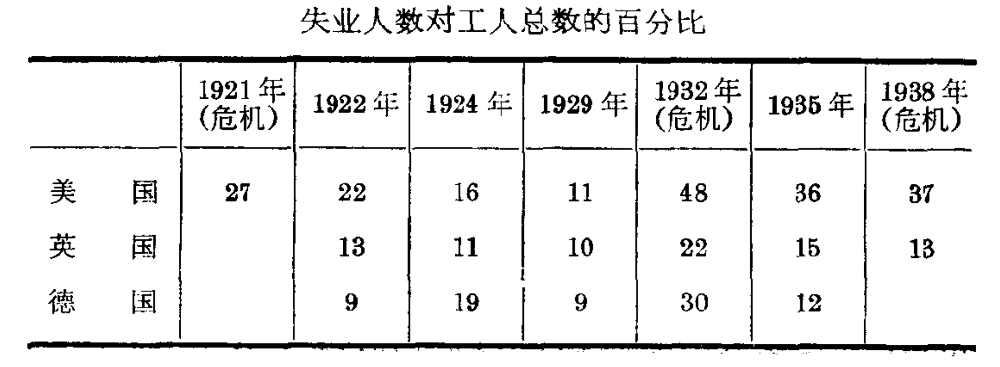

# 凯恩斯主义的产生

## 凯恩斯主义产生的历史背景

凯恩斯主义是庸俗经济学的一个流派。它提出了一套稳
定经济的理论与纲领，企图借此来克服危机，消灭失业，挽
救垂死的资本主义制度。这种神话曾经轰动了整个资本主义
世界。近三十多年来，它已成为资产阶级经济思想的核心与
各主要资本主义国家经济政策的基础。
一种理论的出现绝不是偶然的，它是在一定的时代背景
下产生的。凯恩斯主义是在资本主义基本矛盾日益尖锐化的
形势下产生的。特别是1929-1933年资本主义世界所爆发
的经济危机，对它的产生有着很大的影响。它反映了资本主义
制度的腐朽与没落。因此，我们要了解它的本质，首先要说明
其产生的历史条件。


\
十九世纪末，二十世纪初，资本主义进入了帝国主义阶
段，特别是在第一次世界大战之后，资本主义所固有的各种矛
盾都在激化。伟大的十月社会主义革命的胜利，冲破了帝国主
义阵线，动摇了资本主义统治的基础，开辟了人类历史的新纪
元，在这样的历史条件下，由于民族解放斗争的不断高涨，殖
民地和附属国的民族资本主义经济有了一定程度的发展，以
及资本主义各国的广大人民群众日益贫困，使得资本主义的
市场问题越发尖锐化和复杂化了。同时，企业开工不足，工人大批失业也已成为普遍的、经常的事情。在两次世界大战之间的二十年中，英、美、法、德等主要资本主义国家的工业，平均开工率只有生产能力的二分之到三分之二。在英国，从 1915一1935年的二十年中，生产设备的开工率平均为67%；美国从1925一1934年的十年中，最重要生产部门生产能力的利用率只有57%。由于企业的经常开工不足，就将千百万工人关在工厂大门以外，形成了一支数量庞大的失业大军。例如英国在1900一1913年间，失业工人占工人总数的百分比摇摆在2.1%与7.8%之闻，而在两次世界大战期间，失业人数达到9.7一22%。在美国，失业工人占工人总数的平均百分比从 1900一1913 年的 8.4% 增长到 1921一1936 年的 15.8%。这说明第一次世界大战后英、美两国失业的严重情形较之战前年代大大增加了


\
大批工人失业成为经常的现象。第一次世界大战以前：产业后备军在危机时期扩大，在高涨时期则比较小。可是到了战后，情况根本改变了。即使在经济比较繁荣的时期，失业规模也很大。各主要资本主义国家经常有几千万失业工人他们从产业后备军变成了失业的常备军。这可以从下列统计材料中看出来。

<figure><figcaption></figcaption></figure>

企业的经常并工不足和大量失业的长期存在，是现代资
本主义的特点之一。在这种情形下，要想牧歌式地把资本主义描绘得天花乱坠，已经成为极端困难的事情了。


1929一1933年资本主义世界经济危机，是历史上最深刻、最长久、最广泛的周期性危机，生产的缩减和失业的范围达到空前未有的程度。在此期间，整个资本主义世界的工业产量下降了44%，失业人数达到四、五千万人。劳动大众的生活更加贫困，这也就促使了工人运动的迅速展开，在英、美、法、德等国都出现了游行示威和罢工的新浪潮，促使资本主义生产方式日趋衰落。


\
在世界资本主义体系日益瓦解和阶级斗争日益尖锐化的形势下，旧的庸俗政治经济学关于资本主义自行调节的理论完全破产了。垄断资产阶级迫切需要新的思想体系来挽救必然灭亡的资本主义制度，它向资产阶级经济学家提出了三项新任务：

* 掩盖现代资本主义种种矛盾之所以极端尖锐化的真正原因，粉饰资本主义现实，证明资本主义经过“调整”还能够继续发展。
* 为垄断资本利用国家权力向劳动大众猬狂进攻找根据，为帝国主义扩军备战作辩护。
* 反对社会主义，反对唯一科学的马克思列宁主义，
  并“防止”无产阶级革命的“危险”。


\
于是，在腐朽的垂死的资本主义的条件下，一个资本主义垄断组织的思想家一凯恩斯粉墨登场了。

***

## 凯恩斯的反动立场

以上我们说明了凯恩斯主义产生的历史条件，现在简单谈谈凯恩斯的生平与活动。这对于了解凯恩斯主义的阶级实质，是有一定帮助的。


\
凯恩斯是英国人，生于1883年，死于 1946年。他的父亲是剑桥大学的注册主任，又是资产阶级的哲学家、经济学家和逻辑学家，母亲担任过剑桥市长。凯恩斯本人在剑桥大学时学习数学，但毕业后却考取了文官，起初在英国印度事务部做官，1913一1914年，他被任命为印度通货与财政皇家委员会的委员，后来进财政部，担任财政方面的机密工作。据说第一次世界大战期间他还是整个协约国财政方面的一个主要策划人。他也做过英国自由党的军师。1928年自由党在竞选的党纲“英国工业前途”中主张通过公共工程和通货膨胀政策来消灭失业现象，主要是受了凯恩斯的影响。1929一1933 年世界经济危机以后，他担任英国内阁财政顾问委员会主席，第二次世界大战期间又担任英格兰银行董事。可见凯恩斯一生的活动都是与统治阶级有着密切联系的。除政治活动外，他也经营私人企业。他是全国互助人寿保险公司的董事长，曾经创办过三个投资公司。所以凯恩斯不仅一生为垒断资本的利益服务，而且他本人就是资产阶级的一员，


\
凯恩斯还以统治阶级谋士的姿态出现于国际舞台。他一生参加国际会议很多，他参加过1919年的巴黎和会与1920 年热内亚国际经济会议。他也是1933年在伦敦召开的世界经济会议的主要人物。1944 年，他率领英国代表团参加在布
里敦森林举行的“联合国货币金融会议”，为成立国际货币基金组织和国际复兴开发银行出谋划策。1945 年英、美举行借款谈判时，他是英方的首席代表。1945年12月国际货币基金组织与国际复兴开发银行成立，他被任命为董事。


\
凯恩斯不仅是代表垄断资本利益的经济和政治活动家，而且是垄断资本的理论家。他从年青时起，就积极替资本主义作辩护。他长期在剑桥大学教书兼任英国皇家经济学会的秘书。从1912年起他是英国著名刊物《经济杂志》的编辑，同时他还办了一些通俗刊物，如《伦敦民族周刊》（后因合并改名《新政治家与民族》）,在当时学术界起了很大的影响。


\
我们从他的著作中更可以看出这个断资本卫士的真正
面自。他的第一本书叫做《印度的通货与财政》，出版于1913 年。在这本书里，他主张把印度的货币紧紧地同英国的货币联系在一起，以便替英帝国主义进一步在经济上掠夺印度铺平道路。凯恩斯的成名是在1919年，这时他发表了《凡尔赛和约的经济后果》，在西方资本主义世界弓起丁广泛的讨论。列宁写道：“[谁也没有象英国驻凡尔赛代表凯恩斯在他的小册子中那样生动地描画了凡尔赛条约](https://www.marxists.org/chinese/lenin-cworks/40/021.htm)”值得注意的是，在这本书的“战前欧洲”-一章中，凯恩斯由于他那强烈的阶级本能和觉，己经预见到阶级斗争的尖锐化，将使资本主义难以顺利地发展，因此他认为应该从世界已经分裂为资本主义和社会主义两个制度、而资本主义制度正在摇摇欲坠的角度，来考察和处理战后欧洲的政治经济问题。他主张不要向德国勒索大量赔款，因为这样会使德国贫困，从而替共产主义在欧洲的传播造成机会。他主张尽量保存德国的领土完整和经济实力，以便使德国起反苏、反共前哨的作用。他狂妄地叫嚣：“反对布尔什维主义的唯一的真正力量，在俄国内部是反革命分子，在俄国以外是恢复德国的秩序和权威。”（《凡尔赛和约的经济后果》）1925年，他代表英国剑桥大学参加苏联列宁格勒科学院两百周年纪念会，回到英国以后，他写了一本《俄国短论》，极力诞毁苏联。正如列宁早在1920年共产国际第二次代表大会上所讲的那样，凯恩斯“[是一个人所共知的资产者，布尔什维主义的死敌，他这个英国市偿把布尔什维主义描绘成畸形的挣拧可怕的东西](https://www.marxists.org/chinese/communist-international/2-192007-08/013.htm#4)”。


\
凯恩斯认为，资产阶级经济学家的主要任务，就是拼凑一套理论，来替资本主义进行辩护。他一生是非常忠实于这个任务的。他一贯从货币数量的变化来解释经济现象的变动，主张实行通货管理以稳定资本主义经济。 1923年他写了本《货币改革论》。他将资本主义的一切弊害归结为货币的不稳定性，因此，他把货币改革问题联系在一个新的主题上一一“医治”资本主义的失业，这一主题贯穿在他后期的全部著作中。1926 年他又发表了一篇论文，题为《自由放任的终结》。在这篇文章中，他提出了一项基本任务，就是要“改进”资本主义。他强调指出，资本主义如果加以明智的管理,就可能比我们可以想象到的任何别种制度更有效地达到我们的经济目的。（《劝说集》）1930年凯恩斯的一部主要著作《货币论》出版了。这本书对货币问题作了详尽的分析，他坚定地主张通过货币政策来调节资本主义经济，妄想通过货币调节来达到资本
主义无危机的发展。


\
1929-1933年的世界经济危机，对凯恩斯的思想的进一步发展产生了巨大的影响。过去他对于资本主义的发展前途是抱着乐观态度的，他认为只要稳定金融和防止货币流通中的紊乱就行了。现在他发现问题不那么简单，1931年他问道：“我们能够挽救现代资本主义金融结构的全部崩溃吗？”于是他的注意力就由货币流通转到一个新问题上，即如何防止生产过剩的危机来挽救垂死的资本主义。1933年，他写了一本小册子，名为《繁枼的途径》。在这本书中，他一开头就说：如果我们的贫困是由手饥荒、地震或战争，是由于缺少物质资料与资源来发展生产，那么我们除艰苦工作和节约外，别无走向繁柴的途径，事实七我们的困难显然不是这一种。他认为，必须扩大用于个人消费和生产设备上的总开支，来消灭危机现象。他提出的办法是：（一）由政府借债举办公共工程，用来弥补消费需求和投资需求的不足；（二）实行通货膨胀，以提高物价，增加就业，在这里，他是把扩大社会需求作为挽救资本主义的手段，这是凯恩斯经济观点进一步发展的重要标志。


\
凯恩斯在以上著作中的主导思想，可以归结为以下三点：（一)他认为危机的产生是由于信用紧缩，银根太紧的缘故，所以他主张采取银根松动政策，降低利息率，使资本家借钱方便，从而刺激私人投资；（二）他认为单靠私人投资还不足以保证资本主义经济的稳定，因而提出赤字支出的纲领，即由政府花费来弥补私人投资的不足，因为政府花费不必象资本家一样，斤斤计较利润，资本家不愿举办的事业，政府应该举办起来，他还认为，政府举办公共工程如修建医院、学校、道路、水利工程等来解决失业问题，不需要花很多的钱，因为它会引起
一系列的生产活动,结果一人就业可以带动更多的人就业，这样就能达到增加社会购买力，制止危机的目的；（三）他提倡奢侈浪费，以此来提高社会的消费需求，他硬说历史上强调节约所造成的灾害比浪费造成的灾害更大。


\
1936 年，凯恩斯的《就业、利息和货币通论》发表了。在这本书中，他将以前零星提出的关于防止经济危机的论点，作了系统化的叙述，从而发展成为一个完整的理论体系，它包含了现在所谓“凯恩斯主义”的经济学说的主要部分。所以这本书是凯恩斯的最重要著作，曾经轰动了资本主义世界，在英、美等国，有人认为这是“凯恩斯的革命”，还有人把他比作经济领域里的达尔文或哥白尼。从此以后，他的著作就不多了，除了儿篇文章外，只写了一本小册子，题目是《如何筹措战费》（1940年）。在这本书中，他主张大部分战费应当由劳动人民负担。这里，凯恩斯对待劳动人民的反革命嘴脸，更是跃然纸上。


\
现在我们可以看到，凯恩斯全部著作的基本内容，就是极力维护资本主义雇佣奴隶制，并且提出了种种拯救资本主义的方案。由于资本主义所固有的矛盾的极端尖锐化，他为这些方案披上“充分就业”的外衣，企图用这种诡计来麻痹工人阶级的思想意识，解除工人阶级的思想武装。由此看来，我门同当前资产阶级经济学中最狡和最危险的这个流派进行斗争，具有十分重要的意义。在下一章，我们要揭露凯恩斯“就业理论”的反科学性，然后在第三章中再对凯恩斯“救治”资本主义的方案进行分析批判，以便彻底揭穿他的反动本质。

