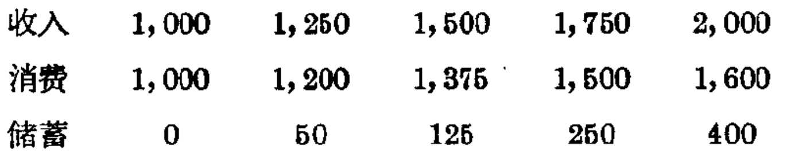
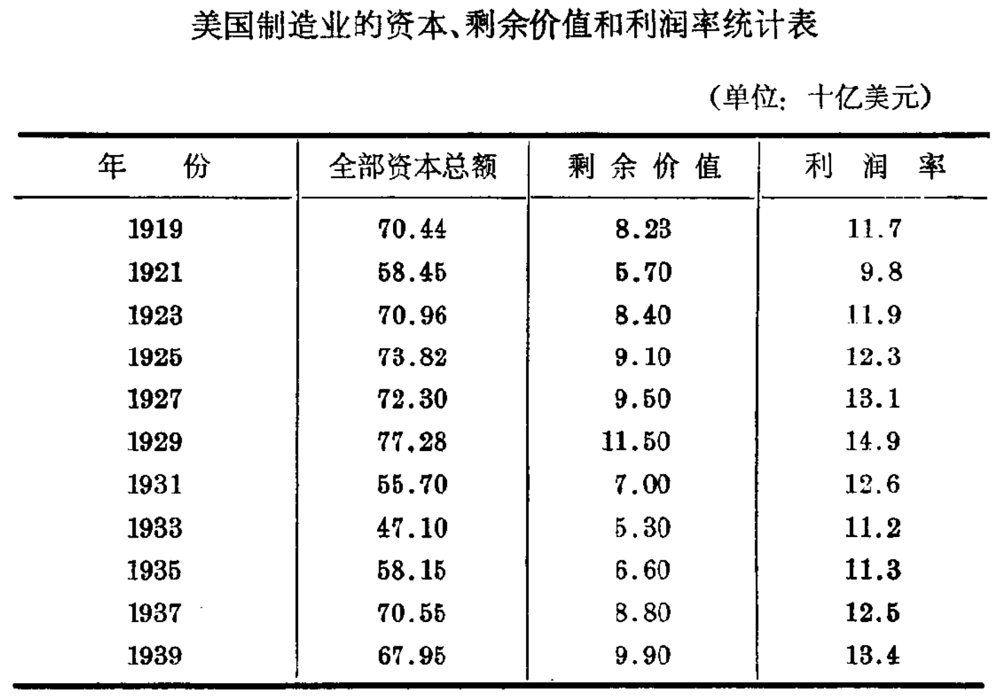
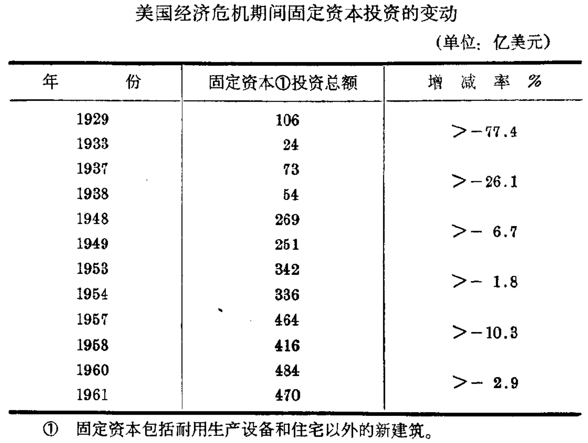

# 虚伪透顶的“就业理论”

## 所谓“有效需求”与就业

凯恩斯就业理论的主要内容是解决失业问题。他为什么这样关心失业问题呢？这是因为在现代资本主义的条件下，大量失业的存在，阶级斗争的紧张状态，使他感到煌恐不安，他害怕大量失业可能引起革命的爆发。失业大军的存在，
一方面对于资产阶级是一种天然的恩惠，它可以用来压制劳动市场，保证廉价的劳动力；但另一方面也是对资产阶级的一种潜在威胁，它威胁着资本主义的存在。照美国资产阶级的一个忠实奴仆菲力普迈雷的说法：“500万失业者是一个威胁， 700万失业者是萧条，1,100万失业者是暴动和流血。”当然，为龚断资本服务的凯恩斯是绝对不赞成完全消灭失业的，他只是渴望找到一个方案，**既能把失业大军的人数减少到不致爆发革命的程度，同时又能保证断资本的最大限度利润**。


\
凯恩斯认为，十九世纪的资本主义是巨大的成功，而二十世纪的资本主义则只有相当的成就。他死不承认现在资本主义的生产关系严重地阻碍了生产力的发展，世界资本主义已经处在崩溃的前夜。他硬说，资本主义还有救，只要经过一些“调整”就可以了。为了维护资本主义，防止危机和失业，他认为必需“修正”资产阶级的传统经济理论。于是他大胆提出了
一个“有效需求”的原理，凯恩斯的就业理论就是以有效需求作为出发点的，他企图根据这个虚构的原理来解释失业现象，并开出治疗资本主义长年滴疾的药方。


\
什么叫有效需求呢？照凯恩斯的说法，**有效需求就是商品的总供给和总需求达于均衡状态时的总需求**。因为资本家经营生产，追求最大的利润，总要考虑供给和需求两方面的情况。在供给方面，他要考虑供给价格，所谓<mark style="color:blue;">供给价格是指资本家在经营生产时所付出的生产要素的成本加上他所预期的最低利润</mark>。总供给价格就是指社会上全体资本家所有的供给价格的总和。在需求方面，资本家要考虑需求价格，所谓<mark style="color:blue;">需求价格是指资本家预期社会上用来购买他的商品的价格</mark>。总需求价格是指全体资本家预期社会上用来购买全部商品的价格的总和。当总需求价格大于总供给价格时，资本家就要扩大生产，增雇工人。相反，当总需求价格小于总供给价格时，资本家就要压缩生产，减雇工人。只有当总需求价格等于总供给价格时，资本家才不扩大生产，也不压缩生产，这时资本家预期的利润达到最大量。在总供给价格和总需求价格达于均衡状态时的总需求，就是凯恩斯的有效需求。**因为总就业量决定于总需求，总需求等于总收入，所以凯恩斯的一般就业理论也就是总需求或总收入理论**。他认为，在没有国家干预经济生活的条件下，资本主义社会的总需求一般不足以实现“充分就业”。而且工业高度发展的国家都患着需求不足的慢性症，国家愈富强，这种不足就愈严重，结果产生一种矛盾的现象，即一方面生产过剩，另一方面般人的欲望得不到满足。为什么会发生这种矛盾现象呢？在他看来，这是因为没有足够的需求去购买所有生产出来的物品。为什么需求不足呢？**这&#x20;
是因为消费太低和投资萎缩的缘故**。


\
他的基本论点是这样的：就业的数量决定于生产的范围，而生产的范围决定于社会总需求的大小。例如在美国，一些凯恩斯主义者认为，第二次世界大战后的标准“充分就业”是每年能生产2，000亿美元（按1944年的美元价值计算）的国民财富，但要保证达到充分就业与充分生产水平，就要有支出2，000亿美元的社会需求。社会总需求是由对消费品的需求和对生产资料的需求构成的，这就是说，**生产与就业决定于消费与投资的多少**。照他的看法，**社会实际收入增加时，消费也将增加，但不及收入增加得那么多**。因此，要有足够的总需求来支持就业的增长，就必须增加投资来填补收入与消费间的差额。换句话说，**除非投资增加，就业是无法增加的**。这就是他所谓有效需求原理的核心。所以凯恩斯理论与其他资产阶级理论不同的主要一点，就是他说资本主义制度不一定会产生足够的社会总需求，使得全部生产要素都能充分利用。凯恩斯主义的美国信徒克兰写道：凯恩斯的“革命”只是发展了一个有效需求的理论，即决定生产总量的水准的理论。这一原理能站得住脚吗？我们可以从四方面来加以分析。

> 首先，理论的出发点是解决就业问题，怎样把失业问题控制在一定的程度当中，直观的通过供求关系来看，社会上劳动力商品的相对过剩，就是因为市场生产不需要那么多劳动力，为什么呢？只要有些许社会实践的人都能意识到，不是市场生产不需要更多的劳动力，如果你自愿无偿为老板打工，谁会不要你呢？而是资本家不愿意花更多的钱去雇佣劳动力，如果仅仅通过加强对现有数量工人的剥削压榨，延长他们的工作时间，加强他们的劳动强度，就能满足他的不变资本实际需要的可变资本提供的劳动时间，我们知道，剩余价值等于可变资本乘以剩余价值率（剥削率），我们可以拿固定资本的折旧时间作为一个标准，固定资本作为不变资本，它需要通过活劳动对它的使用才能将自身的价值转移到商品当中去，这样来说，对于同一个固定资本，都有一个完全转移所需要的劳动时间，而假如这通常需要X可变资本，它提供Y的劳动时间，只需要资本家提高对劳动力的剥削程度，就能使提供的劳动时间变为Y+a，而资本不需要这么多劳动时间，他就会减少雇佣劳动力，同时，当市场上劳动力普遍出现供大于求时，Y+a劳动时间对应的可变资本只会变为k(Y+a)-b，使用固定资本折旧作为标准的意义应该和资本的周转有关[^1]，所以这完全和资本家有关，是资本家对生产资料的私人占有，以及对剩余价值的贪婪追求才导致的社会失业问题，但是凯恩斯怎么会不知道呢？他硬要说这是因为社会需求不足，而需求不足又是因为~~收入不足~~消费太低和投资萎缩的缘故，这就像在说，你学习不好是因为你的考试成绩差，你在班里的排名低，所以呢，为了让你的学习变好，你需要提高你的学习成绩，提高你在班里的排名，这种说废话是现代资产阶级经济学的一个基础，循环论证这个概念是资产阶级经济学的一个重要内容，它让无话可说变成了废话连篇。


\
首先，凯恩斯用供求关系来说明有效需求，然后又用有效需求来说明总就业量。他把资本主义社会人民大众贫困失业的原因说成是由于总需求不够。**他找出失业的“主要原因是花钱太少”**，只要政府采取正确政策就能够消除失业现象，好象失业与资本主义制度毫无关系。但是供求关系能够说明危机和失业吗？马克思写道：[“‘社会需要’或规定需要原则的东西本质上要由不同阶级的相互关系和他们各自的经济地位来规
定。](https://xn--rcrx9d57rqmar1qqlj8k8d.com)”所以失业的根本原因在于资本主义的生产关系。在资本主义制度下，资本家为了摆取更多的利润，为了使自已能在激烈的竞争中获得胜利，就必须改进技术，采用新式机器，扩大生产规模。随着技术的改进，以生产资料（机器、广房、原料等等)形式而存在的不变资本部分增长较快；相反地，用来购买劳动力的可变资本部分的增长要慢得多。因此，随着资本积累的增加，技术的不断进步，不变资本在资本总量中所占的比重越来越大；可变资本的比重越来越小。可变资本的比重下降，意味着资本对于劳动力的需求相对地减少了，因而失业人口大量增加，造成相对的人口过剩，即产业后备军。这是资本主义生产方式所特有的规律，绝对不是凯恩斯的说教所能掩盖得住的。

> 马克思的话总是那么充满辩证法，不是将社会需求作为一个抽象的名词随意玩弄，而是告诉你，它要有具体的特殊的社会生产关系来决定，不同社会生产关系中的起着不同作用的处于不同地位社会集团的需求是不同的，这和资产阶级经济学中的“理性人”截然相反，或许这种“理性人”会对未来社会当中量子通信需要的卫星基站充满着无可比拟的痴迷和需求，显然他是不懂社会需求是要基于当前的生产力水平的，人们根据当前的生产力水平，根据自己使用的生产工具以及生产对象才会形成一定的需求，从这一点上就能很明确的意识到，需求这种东西是一种作为人主观能动性的物质运动形式，更不用说所谓的“人性”，这种荒谬的概念充斥着资本主义社会的各个角落，怎么会有这样的事情呢？到底



剥削阶级的一种反动谬论，它否认人的社会性和阶级性，主张人具有
天生的固定不变的共同本性。


人性论是维护剥削制度的反动思想工具。一切剥削阶级总是把他们的
贪婪、残暴、享乐等吃人本性，说成是“人类共同的本性”，目的是要论
证“剥削有理，压迫有理、造反无理”。奴隶主阶级代表孟轲鼓吹“善”
是人类先天具有的本性，他所谓的“善”就是维护奴隶制的道德观念“仁、
义、礼、智”，谁违反这种道德观念，就是违反了“人类的本性”。总之，
奴隶主阶级的统治秩序是神圣不可侵犯的。资产阶级宣扬所谓“自爱”、
“自保”是人类的本性，这是把资产阶级的唯利是图的本性说成是“普遍
人性”，借以证明资本主义私有制是永恒不变的。现代修正主义者宣称他
们追求“幸福生活”，是合乎人的本性的，这充分证明他们是地地道道的
资产阶级。


\
马克思主义主张阶级论，批判人性论。马克思在《关于费尔巴哈的提
纲》中指出：“人的本质并不是单个人所固有的抽象物。在其现实性上，
它是一切社会关系的总和。”（《马克思恩格斯选集》第一卷 18 页）在
阶级社会中，社会关系就是阶级关系，人的本质就是阶级本质。任何人都
在一定的阶级地位中生活，各种思想无不打上阶级的烙印。毛主席说：
“只有具体的人性，没有抽象的人性。在阶级社会里就是只有带着阶级性
的人性，而没有什么超阶级的人性。我们主张无产阶级的人性，人民大众
的人性，而地主阶级资产阶级则主张地主阶级资产阶级的人性，不过他们
口头上不这样说，却说成为唯一的人性。”（《毛泽东选集》一卷本 827
页）这是对人性论最深刻的揭露和批判，也是对马克思主义关于人性问题
的科学阐述。


\
从人性论出发，必然要反对阶级分析方法，抹杀阶级矛盾，否认阶级
斗争，宣扬阶级合作，并直接引出机会主义路线。孔孟的忠实信徒刘少奇
和林彪，是人性论的狂热拥护者和鼓吹者。他们吹捧反动儒家的所谓“己
所不欲，勿施于人”和所谓“仁义道德”，是“人的关系”的最高原则，
根本抹杀人的阶级性和阶级对立。这显然是为推翻我国无产阶级专政，复
辟地主资产阶级专政制造反革命舆论。



人们在生产过程中形成的社会关系，也叫社会生产关系。它是在一定的生产力基础上必然产生的物质关系。

&#x20;生产从来都是社会的生产。在生产过程中，不但发生人同自然界的关系，而且人们相互之间也发生一定的生产关系。只有结成一定的生产关系， 人们才能去改造自然，征服自然，才会有社会生产。毛主席指出：“在没有阶级的社会中，每个人以社会一员的资格，同其他社会成员协力，结成 一定的生产关系，从事生产活动，以解决人类物质生活问题。在各种阶级的社会中，各阶级的社会成员，则又以各种不同的方式，结成一定的生产关系，从事生产活动，以解决人类物质生活问题。”（《实践论》）生产 关系是人们一切社会关系中最基本的关系，是建立政治法律制度和各种思想意识形态等上层建筑的经济基础。在阶级社会里，它表现为阶级关系， 每个人都处在一定的阶级关系中。生产关系包括三个方面：第一，生产资料的所有制形式；第二，人们在生产中的地位和它们的相互关系；第三， 产品分配形式。其中生产资料所有制是主要方面，它决定生产关系的性质。 生产关系的状况主要说明生产资料归谁所有，由谁支配的问题。人们在生产中的地位和相互关系，以及产品分配形式，也是生产关系的重要方面， 对于生产资料所有制的巩固和发展起着重要的作用。

&#x20;生产关系有两种互相对立的基本类型。一种是以生产资料公有制为基 础的生产关系，原始公社生产关系，社会主义生产关系，以及将来的共产 主义生产关系，都属于这种类型。在这种生产关系下，生产资料以不同的形式为社会所公有。人们之间的相互关系，在原始公社是简单的劳动协作关系；在社会主义社会，劳动人民之间是相互合作、相互促进的同志关系， 劳动人民同剥削阶级之间是改造和被改造的关系；在未来的共产主义社会 是自觉的共产主义协作关系。在产品分配方面，由于生产力水平和公有制 发展程度不同，因而分配形式也不相同。在原始社会是平均分配；在社会 主义社会是“各尽所能，按劳分配”；在共产主义社会是“各尽所能，按需分配”。

&#x20;另一种是以生产资料私有制为基础、以阶级剥削和阶级压迫为特征的生产关系。奴隶制度、封建制度和资本主义制度的生产关系，都属于这一类型。在这种生产关系下，生产资料为少数人的剥削阶级所占有，而多数人的被剥削阶级则没有生产资料或只有很少的生产资料，这就决定人们在生产过程中的关系，是少数人统治、压迫和剥削多数人的关系。在分配关 系反面，占有生产资料并处于统治地位的阶级，能够用各种形式（如封建制度下的地租，资本主义制度下的利润等）不劳而获地占有绝大部分产品； 而不占有生产资料和处于被剥削、被压迫地位的劳动人民，则只能得到很少的生活资料。这种分配关系是一种剥削和被剥削的关系。这种类型的生产关系具有对抗的性质，它必然表现为剥削者和被剥削者之间的极残酷的阶级斗争。资本主义生产关系是最后一种以私有制为基础的对抗性的生产关系，它必然要被社会主义生产关系所代替。&#x20;

生产关系的发展和变革为生产力所决定，同时它又反作用于生产力。 旧的、腐朽的生产关系阻碍和破坏生产力的发展，新的生产关系能够解放劳动者和生产资料，是推动生产力发展的决定性力量。生产关系的新陈代 谢是社会发展的普遍规律。在社会主义国家里，仍然存在着生产关系和生 产力之间、上层建筑和经济基础之间又相适应又相矛盾的情况，必须注意 解决生产关系方面的问题，注意抓好上层建筑领域里的社会主义革命。从 伯恩施坦到林彪等新老修正主义者都竭力鼓吹唯生产力论，抹杀生产关系对于生产力的反作用，否认变革生产关系的必要性，其目的就是妄图保护 或复辟资本主义生产关系，开历史倒车。




\
其次，<mark style="color:blue;">**凯恩斯的有效需求原理完全是主观唯心的**</mark>。前面讲过，凯恩斯认为，所有资本家在雇佣工人生产一定数量产品时，要从两方面来考虑，一方面预期出售后要获得多少总收入才合算，另一方面预期社会上将愿出多少总价格来购买。如果前者小于后者，他们将增雇工人，扩充生产；反之，他们将减雇工人，缩减生产。实际就业量决定于两者相等的一点，这时资本家预期社会上用来购买全部商品的总价格就叫做有效需求。非常明显，<mark style="color:blue;">**他把社会就业量的变动归之于资本家心理上的预期，这是一种最庸俗最荒诞的主观唯心论**</mark>。**他把经济的现象看成心理的现象，把客观的事物化为主观的心情，他希望借着这种魔术的作用，将危机和失业的真正原因，从社会制度推向人们的心理，以便掩盖资本主义社会的一切对抗性矛盾**。当他提出资本家情绪的波动是周期变动的根源时，他极力主

张对付危机的最好办法在于转变资本家的悲观情绪，企图用这种荒唐的论断为保证龚断高额利润的反危机措施提供理论基础。


\
再次，凯恩斯的有效需求原理是采取总量分析的方法，即研究社会上总产品的供给和需求间的均衡，而完全**忽视了资本主义社会各生产部门之间的有机联系**。根据马克思关于社会再生产的原理，<mark style="color:blue;">要使社会产品实现，社会产品的各部分之间，因而生产的各部门之间，必需保持一定的比例关系</mark>，例如在生产资料生产与消费资料生产之间以及在每一部类的成于成万的分支机构之间，如在棉织品生产与纺织机器生产之间，在机器工业与钢铁工业之间，都要保持定的比例关系。资本主义生产的社会化，使得各个生产部门和各个企业之间的相互联系、相互依赖更加密切了。为了保证国民经济的顺利发展，不仅生产领域内的各个部门之间要保持一定的比例关系，而且在生产、分配、交换和消费之间也应该保持适当的比例：建立必要的平衡，否则一环脱节，就可能造成整个锁链的解体，从而引起经济的衰退。而资本主义所固有的生产和消费间的矛盾以及生产的无政府状态，使这些比例关系不能不经常遭到破坏。**但是凯恩斯却不管这些实现社会再生产所必须具备的比例关系，而片面地认为只要保持足够的社会需求，危机和失业就可以消除了**。这岂不是痴人说梦话吗？

> 商品生产是一定生产力水平下的生产关系，它本身是为了解决随着社会分工的专门化以及私人所有制之间的矛盾，通过等价交换，将具有不同使用价值的劳动产品，通过某种同质的社会关系联系起来，那就是它们都是人类抽象劳动的对象化，或者抽象劳动过程本身，同质的东西可以进行数量的比例换算，这样，社会劳动产品的实现就依靠商品交换得以实现和调节，但是这种看似合理的交换方式，其实是不合理的，这就是说这种等价交换本质上是不等价的，因为世界上没有抽象的关系，只有具体的关系，人类社会的发展总是要通过它内部的矛盾斗争，通过时刻变换的物质运动内容，世界上除了运动的物质以外什么都没有，这就是再说，任何生产技术的应用和提高，都在改变着现实的社会生产关系，**进行等价交换的不是纯粹的抽象的劳动时间，不是价值，而是带有社会当前具体生产关系内容的物质**，这些物质之所以可以通过等价交换这种社会关系联系起来，本身就是因为它代表着具体的生产力和生产关系的内容。等价交换的是承载人类抽象劳动的使用价值，但是交换的两个使用价值所内含的人类抽象劳动必然是相同的吗？显然不是，而且无数偶然的交换也不是完全相同的抽象劳动的交换，只是说这种必然性，这种规律性的本质是抽象劳动的等价交换。这样说有什么意义呢？这个意义就是，商品生产会自发的造成社会的不平等，阶级的出现，列宁说：“[小生产是经常地、每日每时地、自发地和大批地产生资本主义和资产阶级](https://www.marxists.org/chinese/lenin/192004/02.htm)”。商品交换就是这样促使生产力发展的，它将无数劳动群众抛到生存的独木桥上，所有人都得小心艰难的保持生存的平衡，而另一边是少数寄生阶级，它们用私有制的航船开辟了新的海域，但是现在船得靠岸了，劳动群众可以靠自己的双手建立起一个新的，充满活力的新世界，这个世界没有人对人的压迫，没有自我出卖，人们可以自觉的调节生产关系，自觉运用社会发展规律去实现自己的价值，全面发展。


\
最后，凯恩斯的有效需求原理含有明显的内在矛盾。因为他所说的社会总需求，也就是指社会的购买力，然而社会购买力的大小是和就业水平有关的。就业水平高时，社会购买力就大；反之则小，这是非常明显的道理。然而凯恩斯的逻辑是：**要保持充分就业就必需有足够的社会购买力来消纳充分
就业时所生产的产品，而足够的社会购买力依靠充分就业充分就业又依靠社会购买力**。这是一种非常荒谬的循环论证。
\

由此看来，凯恩斯的有效需求原理是根本不能成立的。在
以下两节，我们还要对他所谓有效需求的两个构成部分消费需求与投资需求，分别进行批判。

***

## “消费不足”是由于根深蒂固的“人性”吗？

依照凯恩斯“就业理论”的说法，就业量决定于有效需求，
而有效需求文决定于消费支出和投资支出。那么消费支出的大小又是怎样决定的呢？


\
凯恩斯承认在资本主义制度下，消费是落后于生产的，这是他比他的前辈较现实的一点。但是他闭口不谈这种情形产生的社会根源，却捏造出来一条“基本心理规律”，企图混淆视听。他说：**根据对于人类天性的知识和实际的经验，当人们的收入增加时，一般总是增加消费，不过消费的增加赶不上收入的增加，一部分收入被储蕃起来了。由于这个原因,所以生产出来的商品，不能全部销售出去，从而引起生产的收缩和失业的发生**。假定把整个社会的收入与消费列成一表如下（单位：亿美元）：

<figure><figcaption></figcaption></figure>


\
根据上表，凯恩斯说，当社会总收入为1，000亿美元时
全部收入都用之于消费。当总收入增至1，500亿美元时，消
费只增加到1，375亿美元，没有花费的125亿美元被储蓄起来了。当总收入增至2,000亿美元时，消费只增加到1,600 亿美元，没有花费的400亿美元被储蕃起来了。如果这一部分收入被储蓄后，人们不用之于投资，那么社会需求就要减少，生产就会过剩（生产是2,000亿美元，而社会需求只有1，600 亿美元，这时候就将有千百万工人失业。这样一来，他就很轻易地将失业的原因归之于社会消费量的不足。**而社会消费量的不足，不是导源于资本主义制度，而是由于“心理规律”的作用**。


\
几乎所有资产阶级经济学家都认为凯恩斯的“消费定律” 是一个特殊贡献，美国的凯恩斯主义头子阿尔文·汉森甚至说它是“划时代的”。其实，早在十九世纪初期，马尔萨斯和西斯蒙第就已经提出了这种思想，在这方面凯恩斯与他们是一丘之貉。所不同的是，旧的消费不足论的前提是：消费的不足是收入缺乏的结果；**而新的消费不足论的前提是：人们的收入是充足的，只是没有把它花光**。凯恩斯对他的前辈的学说的“修正”，更加暴露了它的反动本质。他从根深蒂固的“人性” 来说明消费的不足，然后再从消费不足来说明危机和失业的原因，企图用这种无耻的捏造作为替资本主义制度辩护的论据。对于凯恩斯的消费理论，我们打算从两方面来加以批判：第一，资本主义社会的消费不足决不是由于“人性”的关系或“心理规律”的作用；第二，消费不足也不是危机和失业的根本原因。现在就来说明第一个问题。


\
凯恩斯的“消费定律”一一消费的增长赶不上收入的增长，是从根深蒂固的“人性”引伸出来的。“[有没有人性这种东西？当然有的。但是只有具体的人性，没有抽象的人性。在

阶级社会里就是只有带着阶级性的人性，而没有什么超阶级的人性。](https://www.marxists.org/chinese/maozedong/marxist.org-chinese-mao-194205.htm)”这就是说，人性并不是超时代的东西，它是历史的、社会的产物，随着历史和社会的发展而不断变化发展的。在一定的阶级社会里，人是在具体的阶级关系中占着一定地位的人，因此人性就得由人们的阶级关系来决定。所以，抽象的人性是不存在的。**但凯恩斯抹煞了人性的阶级性，而从抽象的人性出发来说明消费关系，这是道道地地的唯心史观，凯恩斯的“消费定律”就是建立在这种主观唯心论的基础上，所以它是极端虚伪而不符合实际的。**


\
凯恩斯断言：当收入增加时，消费相对地减少，而储蓄相应地增加。但是美国统计材料所表明的恰恰与他的说法相反。


\
下表表明，从1944一1955 年的十二年里，就有六年收入（纳税后的收入)虽然增加，而储蓄反而减少了。例如1955 年的收入比1954年增加了146亿美元，储蓄却降低了12亿美元，储蓄对收入的百分比从7.2%下降到6.3%。七十年代也有类似情形。例如1972年的收入比1971年增加了507 亿美元，储蓄却降低了55亿美元，储蕃对收入的百分比从 10.7%下降到9.3%。这说明“消费定律”根本站不住脚。


\
凯恩斯捏造这一“消费定律”的真实意图是什么呢？


\
<mark style="color:blue;">**凯恩斯从人类本性捏造出一个各阶级所共有的统一的“消费定律”，因此资本主义社会消费的阶级差别就被他一笔勾销了。人所共知，在资本主义制度下，根本谈不到工人阶级的消费落后于收入的增长，而是收入落后于最低生活费用。**</mark>

<figure><figcaption></figcaption></figure>

在
国民收入中工人阶级所得的份额不断下降，而剥削阶级所占的份额却不断增长。1889年，美国产业工人工资总额为资本家利润总额的69%，1919年为61%，1929年为48%，1939年为45%。列宁写道：“[雇佣工人以工资形式取得的那一部分自己创造的财富，非常之少，刚能满足最追切的生活需要，因此，无产者根本不能从工资中拿出一些钱储蓄，以备在伤残疾病、年老、残废丧失劳动能力时，以及与资本主义生产方式紧密联系的失业时的需要。](https://www.marxists.org/chinese/lenin-cworks/21/015.htm#18)”事实完全证实了这一点。据美国官方规定，城市个四口之家，每年收入在3,988美元以下即所谓“贫困线”以下的人家，便属贫民。美国国情普查局1972年7月公布：1971年生活在这个“贫困线”以下的穷人有二千五百六十万人，约占美国人口的百分之十二强。这也就是说，在1971年，大约每八个美国人中就有一个人被官方正式认为是穷人。生活在“贫困线”以下的人数加上领取“救济金”人数以及其他贫穷人口，则高达五千多万人，占美国人口总数的四分之一以上。他们挤在贫民窟和断垣残壁的屋子里，过着非人的生活。“人民资本主义”鼓吹者亚尔道夫·亚·贝尔的妻子在一份调查报告中，描述纽约80个典型家庭的情况时说：他们贫困不堪，疾病迅速蔓延，无法得到医疗，孩子们没有地方睡觉，没有地方上学。十分明显，**工人阶级的消费不足，绝对不是由于他们的收入增长因而消费相对地降低了，而是由于他们的收入被限制在最低水平，实际上他们的消费不是相对的减少，而是绝对的减少了**。一般工人的收入连维持最低的生活都不够，还能说他们的储蓄太多了吗？1946年美国产联曾举行全国性的调查。结果证明，它所访问的工人家庭中，有71%的家庭，储蓄额不到 300美元，有许多家庭简直什么存款也没有。美国的官方统计尽管煞费心机，打了不少折扣，但也掩盖不了这一重大事实。联邦储备银行在 1951年 1月到3月间的储蓄调查表明：在美国，40%的家庭根本没有任何储蓄，30%的家庭只占储蓄总额的9%，10%薪金收入较高的家庭占9%，而20%的上层家庭则占所有储蓄总额的82%，其中10%的最上层家庭占有储蓄总额的65%。换句话说，美国人口的十分之一占有储蓄总额的三分之二。这是资本积累的结果。资本家为了追求更
多的利润和增强竞争实力，必然不断地积累资本，扩大生产规模。**所以凯恩斯的消费定律，在一定条件下，似乎也只适用于资产阶级特别是垒断资产阶级，而不适用于工人阶级**。甚至一位资产阶级的学者吉尔贝也说：“并无明显的事实证明，消费的心理规律乃是个人性的基本规律。·凯恩斯似乎是提出一条定理，它只是在一定时期适用于一定的集团，而不成为一般的心理规律，可以在一切时期用来描述一切人的行动。”<mark style="color:blue;">**凯恩斯企图抹煞阶级的差别，把资本家的利润收入和股职工的工资混为一谈，把工人阶级的消费资本家的消费混为一谈，而使用一些暖味的名词（总收入、总消费、总储蓄）；以掩盖资本主义内部的阶级差别和阶级矛盾，这种手段是相当毒辣的。**</mark>


\
以上说明，资本主义社会的消费不足，并不在于什么根深蒂固的“人性”，而在于资本主义的生产关系，事实也完全驳倒了凯恩斯的“消费定律”。现在我们再来分析第二个问题：消费不足是危机和失业的根本原因吗？


\
凯恩斯企图从人们的心理特征引出一条“消费定律”，然后根据这一虚构的定律辩称：收入愈大，则储蓄愈多，于是社会愈富，则收入与消费间的差额也愈大，以此作为高度发展的资本主义带有更大危机倾向的理由。凯恩斯不承认危机是由于资本主义生产方式的固有矛盾所引起的，却把它归罪于消费不足。对这种浅陋的“消费不足论”，我们只要指出两点就够了。

> 资本主义生产方式的固有矛盾即生产的社会化与生产资料私人占有之间的矛盾，生产社会化是什么意思呢？[这里](https://www.marxists.org/chinese/lenin/15.htm#1)应用列宁在《帝国主义是资本主义的最高阶段》的一段。：
>
> 　　“竞争转化为垄断。生产的社会化有了巨大的进展。就连技术发明和技术改进的过程也社会化了。\
> \
> 　　从前是各个业主自由竞争，他们是分散的，彼此毫不了解，他们进行生产都是为了在情况不明的市场上去销售，现在则完全不同了。集中已经达到了这样的程度，可以对本国的，甚至像下面所说的，对许多国家以至全世界所有的原料来源（例如蕴藏铁矿的土地）作出大致的估计。现在不但进行这样的估计，而且这些来源完全操纵在一些大垄断同盟的手里。这些同盟对市场的容量也进行大致的估计，并且根据协议“瓜分”这些市场。他们垄断熟练的劳动力，雇用最好的工程师，霸占交通路线和交通工具，如美国的铁路、欧美的轮船公司。帝国主义阶段的资本主义紧紧接近最全面的生产社会化，它不顾资本家的愿望与意识，可以说是把他们拖进一种从完全的竞争自由向完全的社会化过渡的新的社会秩序。\
> \
> 　　生产社会化了，但是占有仍然是私人的。社会化的生产资料仍旧是少数人的私有财产。在形式上被承认的自由竞争的一般架子依然存在，而少数垄断者对其余居民的压迫却更加百倍地沉重、显着和令人难以忍受了。\
> \
> 　　德国经济学家克斯特纳写了一本专论“卡特尔与局外人斗争情况”的著作，所谓“局外人”就是未加入卡特尔的企业家。他给这本着作取名为《强迫加入组织》，其实，如果不粉饰资本主义，就应该说是强迫服从垄断者同盟。单是看看垄断者同盟为了这种“组织”而采取的种种现代的、最新的、文明的斗争手段，也是大有教益的。这些手段有：(1)剥夺原料（“...强迫加入卡特尔的主要手段之一”）；(2)用同盟方法剥夺劳动力（即资本家和工会订立合同，使工会只接受卡特尔化企业的工作）；(3)剥夺运输；(4)剥夺销路；(5)同买主订立合同，使他们只同卡特尔发生买卖关系；(6)有计划地压低价格（为了使“局外人”即不服从垄断者的企业破产，不惜耗费巨资，在一段时间内按低于成本的价格出售商品。）；(7)剥夺信贷；(8)宣布抵制。\
> \
> 　　现在已经不是小企业同大企业、技术落后的企业同技术先进的企业进行竞争。现在已经是垄断者在扼杀那些不屈服于垄断、不屈服于垄断的压迫和摆布的企业了。下面就是这一过程在一位资产阶级经济学家意识中的反映。\
> \
> 　　克斯特纳写道：“甚至在纯粹经济的活动方面，也在发生某种转变，原先意义上的商业活动转变为投机组织者的活动。获得最大成就的，不是最善于根据自己的技术和商业经验来判断购买者需要，找到并且可以说是‘开发’潜在需求的商人，而是那些善于预先估计到，或者哪怕只是嗅到组织上的发展，嗅到某些企业与银行可能发生某种联系的投机天才\<?!>...”\
> \
> 　　译成普通人的语言，这就是说：资本主义已经发展到这样的程度，商品生产虽然依旧“占统治地位”，依旧被看作全部经济的基础，但实际上已经被破坏了，大部分利润被那些干金融勾当的“天才”拿去了。这种金融勾当和欺骗行为的基础是生产的社会化，人类历尽艰辛所达到的生产社会化这一巨大进步，却造福于……投机者。下面我们会看到，那些对资本帝国主义作小市民式的反动批评的人，怎样“根据这一点”而梦想**开倒车**，恢复“自由的”、“和平的”、“诚实的”竞争。”\
> \
> 为什么生产资料的垄断和集中会加剧生产的社会化与生产资料私人占有之间的矛盾呢？仔细想一想。


\
第一,在一般情况下，危机是紧跟着经济的高涨时期，那
\
时就业达到相对的最高水平，工资也会有所提高。那末，既然工资提高广，消费增加了，为什么反而会爆发危机呢？


\
第二，危机和萧条时期失业人数激增，因而消费水平是最
低的。为什么这时的低消费水平并不影响周期上升阶段经济的复苏呢？


\
此外，**劳动人民的消费不足是自人类社会分裂为剥削阶级与被剥削阶级以后就发生了，但经济危机却是在资本主义出现后才爆发的**。正如恩格斯所指出的：“[······群众的消费水平低，他们的消费仅仅限于维持生活和延续后代所必需的东西，这并不是什么新的现象。自从有了剥削阶级和被剥削阶级以来，这种现象就存在着。就是在群众的状况特别好的历史时期，例如在十五世纪的英国，群众的消费水平仍然是低的。他们远没有拿过自己每年的全部产品来消费。因此，如果说，消费水平低是数千年来的经常的历史现象，而由生产过剩所引起的、爆发于危机中的普遍的商品滞销，只是最近五十年来才变得明显，······](https://www.marxists.org/chinese/marx-engels/20/005.htm#3)”这说明,**在资本主义制度下，消费不足是一个事实，但不能用来解释危机**。列宁曾经指出：“[我们所谈到的两种危机理论，对危机的解释完全不同。第一种理论用生产和工人阶级的消费之间的矛盾来解释危机，第二种理论用生产的社会性和占有的私人性之间的矛盾来解释危机。······试问，第二种理论是不是否认生产和消费矛盾的事实、消费不足的事实呢？当然不否认。它完全承认这种事实，但是把这个事实放在应有的从属的地位，并且看做只是和资本主义总生产的一个部类有关的事实。**它认为这种事实不能解释危机，因为危机是由现代经济制度中的另一个更深刻的基本矛盾，即生产的社会性和占有的私人性之间的矛盾引起

的**。](https://www.marxists.org/chinese/lenin-cworks/02/009.htm#1-7)”生产和消费的矛盾不过是这一基本矛盾的一种主要表现罢了。所以凯恩斯的“消费不足论”是非科学的。

***

## “投资不足”是因为利润太低吗？

从凯恩斯的立场来看，失业的产生是由于有效需求不足，
有效需求不足的原因之一是由于消费太低，解决的办法是多消费。但他也了解，在贫富两极化的社会里，**扩大剥削阶级的寄生性消费，无异杯水车薪**，解决不了什么问题，所以他对于增加消费的作用不太乐观。因此他又建议**采用刺激投资的办法来扩大社会需求**。他硬说，假如可能通过投资的增加来弥补消费的不足，从而提高生产，增加就业，则消费不足就不会有那么大的危害。他还指责旧的消费不足派太着重于增加消费而忽略了扩大生产的另一个途径一一增加投资。他认为，增加生产和促进就业的最聪明的办法是双管齐下，即增加投资和提高消费同时并进。他强调说：他的就业理论和经济纲领的重点，是建筑在投资需求方面的。他在1937年发表的《就业通论》这篇论文中写道：“这个理论可以概括地说，**在一定的社会心理下，整个生产和就业的水准，决定于投资总量**。”


\
在现代资本主义条件下，投资的情况是怎样呢？


\
在十九世纪时固定资本差不多一直是在逐渐增长的，但是并没有挽救资本主义国家经济危机的命运，差不多每隔八年至十二年，就要发生一次危机。而每次危机都大大扩充了失业大军的队伍。到了二十世纪特别是第次世界大战以
后，资本增长率才不断下降：从十九世纪末期每年平均增长 5%强降低到二十世纪最初十年的平均每年增长4.3%，第二个十年每年为3%，第三个十年每年为2.5%，第四个十年每年为0.1%。资本增长率下降的原因，照凯恩斯的意见，是由于**投资动机的衰退**。他说，投资决定于资本家有没有获得利润的希望，而这一点又取决于两个因素：**利润率与利息率**。如果利润率大于利息率，资本家就进行投资，反之就不投资。他由此推断说，投资的衰减是由于利润率和利息率的比例失调所引起的。这就是说，**投资不足之所以发生，是因为在资本主义发展过程中，利息率虽然下降，但不及利润率下降的程度大**。他企图从利润率和利息率的相对关系来说明投资的不足，然后从投资不足来说明危机和失业现象产生的原因。现在的问题是：第一，投资不足是否因为利润率太低引起的？第二，危机和失业的产生是否由于投资的不足？让我们把这两个问题分别来加以考察。


\
不错，随着资本的积累，资本有机构成不断提高，从而使般和润率下降。但是到了二十世纪二十年代和三十年代，利润率却显示出相当的稳定性，见“美国制造业的资本、剩余价值和利润率统计表”。


\
这一时期利润率的稳定，是因为有一系列因素阻止了它的下降，如资本家强对工人的剥削、机器原料等生产资料的价值因劳动生产率提高而日趋低廉、不变资本的节省和对外贸易的不等价交换等。近二十多年来，由于劳动强度的提高和资本家对工人剥削的进步加强，利润率急剧地增长起来。例如美国加工工业的利润率从1949年的18.5%增长到1951年的27.9%。至于利润量，那就增长得更加惊人了。

<figure><figcaption></figcaption></figure>

<figure><figcaption></figcaption></figure>


\
从“美国公司利润的增长”表可以看出，凯恩斯所谓在发达的资本主义国家利润率很低的说法，显然是不符合事实的。


\
讲到利息率，情形就完全不同了。人人都知道，<mark style="color:blue;">借贷利息是产业资本家因取得贷款而让给借贷资本家的一部分剩余价值，所以通常利息率不会超过平均利润率。在平均利润率的限度内，利息率决定于借贷资本的供求关系。</mark>**在现代资本主
义条件下，利息率是相当低的**。造成这种情况的原因是：由于资产阶级的寄生性和腐朽性不断增长，他们对于组织生产愈来愈不感兴趣，而宁愿做一个靠利息为生的食利者，于是借贷资本的供给不断增加；可是另一方面，现有企业经常开工不足，找不到有利的投资场所，于是借贷资本的供给经常超过需要，因而造成了利息率下降的趋势。

利息和企业利润

职能资本家向借贷资本家借得货币资本以后，便运用所借资本来经营商品生产或者商品流通。不管他经营何种行业，由于他是使用别人的资本，因而不能独自占有由运用所借资本而获得的全部利润，他必须把利润的一部分以利息的形式交给货币资本的所有者。当然，职能资本家也不能把全部利润都交给借贷资本家，因为如果这样，他就不能从运用借入资本当中获得任何好处，从而他也就不会再去借入别人的资本了。所以，在正常情况下，利息只能是平均利润的一部分，而不能是它的全部。利润是剩余价值的转化形态，利息则不过是剩余价值的特殊的转化形态，是借贷资本家凭借资本所有权通过贷出资本收取代价的形式而获得的一部分剩余价值。

由于资本所有权和资本使用权的分离，使得平均利润被分割成两个部分：一部分是归借贷资本家（贷款人）所有的利息，另一部分是归职能资本家（借款人）所有的企业利润。只要平均利润的一部分采取利息的形态，它的另一部分，即平均利润和利息间的差额或平均利润超过利息的这一部分，就会转化为与利息相对立的企业利润的形态。企业利润是在存在利息的条件下产业利润和商业利润的统称，它是原产业利润或原商业利润减去借贷资本利息以后的剩余部分。马克思指出：利息和企业利润，“二者不过是剩余价值在不同范畴，不同部类，不同名称下固定的部分”。

平均利润分割为利息和企业利润，本来只是在职能资本家使用借贷资本的场合才会发生。但是，在资本主义的现实生活中，资本家即使是运用自有的资本进行经营，他们也会像使用借入资本经营的资本家那样，把所获得的利润划分为利息和企业利润。这是因为，“总利润数量上的分割一旦取得独立的形式，这个独立形式就会生出这种性质上的分割”。换句话说，总利润随着数量上的分割而转变成二种性质上不同的东西，其中，利息单纯表现为资本所有权的结果，表现为资本本身的产物；而企业利润则单纯表现为资本家使用资本进行操作的结果，表现为资本家发挥职能的产物。“总利润的这两个部分因此就硬化并且独立化了，好像它们本来就是由两个本质上不同的源泉生出一样”。

随着利润出现这种性质上的分割，使用自己资本进行经营的资本家，在人格上就变成了双重的，资本的所有者和资本的使用者。因为他是资本的所有者（即贷放资本给自己的人），所以要取得利息；因为他是资本的使用者（即职能资本家），所以要取得企业利润。

借贷资本的特殊的运动形态，以及利润之分割为利息和企业利润，使得资本主义的生产关系更加神秘化了。本来，由于剩余价值转化为利润和平均利润、商业资本的独立化等等，剩余价值的来源就已经变得模糊不清了。但是，无论如何产业利润总还表现为生产过程的产物，它终究还与资本和劳动的对立相联系；商业利润尽管从表面上看是由流通过程产生的，但它毕竟还表现为交换即人们之间的一种社会关系的产物。利息和企业利润却不是这样，在这两种形态上，资本和雇佣劳动的对立是一点也看不见了。

就利息来说，在质上，它表现为资本所有权的收入，是资本的自然果实；在量上，利息率虽然依存于平均利润率，但它的确定又有自己的特殊方法。利息率不表现为生产过程和流通过程的结果，而是作为一个既定的事实预先存在于生产过程之前，它不像个别资本的利润率那样经常不断地变动，也不是根据职能资本家使用借入资本获得利润的具体情况来确定。这样一来，利息和工人剩余劳动的关系便被割断了，资本和雇佣劳动的对立便完全被掩盖起来了。

就企业利润来说，也是一样。职能资本家与借贷资本家不同，他是要指挥生产过程和流通过程，要对工人的劳动进行监督的。这样，也就造成一种假象：仿佛企业利润是和利息根本不同的，它不是资本所有权的结果，而是职能资本家作为非所有者、作为劳动者发挥职能的结果，它似乎绝不和工资劳动相对立，绝不是代表他人的无偿劳动。

资产阶级及其代言人向来就是根据以上这些虚假的现象，来看待利息和企业利润的。他们把利息看作是对于货币所有者的“忍欲牺牲”的报酬，是货币本身生育出来的货币，而把企业利润则看作是对于产业资本家和商业资本家的“监督劳动”的报酬，是他们的“监督工资”。这些说法，当然都是荒诞无稽的辩护言词。

任何资本如果不被用来榨取雇佣工人的剩余劳动，不管它的所有者如何“忍欲牺牲”，它也绝不会增加一个价值原子。说资本本身能够产生利息，这和说把钱锁到柜子里它会变多是一样不合理的。借贷资本家虽然不直接和雇佣工人发生关系，但他们是通过职能资本家间接地同雇佣工人发生关系，他们是凭借对资本的所有权，和职能资本家一道瓜分雇佣工人在生产过程中所创造的剩余价值。马克思指出：“在再生产过程中，功能资本家作为别人所有的资本的代表，与工资雇佣劳动者相对立：货币资本家则以功能资本家为代表，而在劳动的剥削上参预进来”。所以，借贷资本家同产业资本家、商业资本家一样，也是无产阶级的剥削者，和无产阶级处于对立的地位。

综上所述，我们可以得出这样的结论：利息和企业利润不外是剩余价值或平均利润的特殊部分，二者都是来源于对雇佣工人的剥削；利息和企业利润的分割，只是资本家分裂为货币资本家和职能资本家的结果；二者数量比例的变化，也只是这两类资本家在竞争中的力量对比发生变化的结果；利息和企业利润的分割及其相互对立，并不能改变它们共同的实质和来源。\
\
（来自于《政治经济学概论》第九章第二节）


\
在美国的金融市场上，短期借贷的利息1866一1880年为 3.6厘（最低率）至17厘（最高率）,1881一1900年为2.63厘至9.75厘，1901一1920年为 2.98 厘至8 厘，1921一1935 年为 0.75厘至 7.81 厘,1945一1956年为 0.75厘至 3.63厘,。


\
根据上述情况，难道说利息率下降的程度小于利润率下
降的程度吗？


\
一方面垄断利润不断增长，另一方面利息率不断下降，于是借贷利息在全部利润中所占比重也就日益减少。据美国商业部调查，美国大型与中型制造厂商中，所付利息占利润（纳税及付息前）10%以上者，1927年有40%，而到1951年只有不到6%了。如果就全部美国公司（包括公用事业在内）来讲,所付利息占收益(纳税及付息前)的比重,在二十世纪的二十年代后期是30%，第二次世界大战前是12%，而在1952年则只有8%了。
根据凯恩斯的说法，投资决定于利润率与利息率的相对关系，只要利润率高于利息率，资本家便会进行投资，直到利润率与利息率相等时为止。现在利润率比利息率要大好几倍，为什么资本家反而不肯投资了呢？事实上，**投资并不决定于利润率与利息率的相对关系，它完全决定于现有的利润水平**。马克思写道：“[决定生产的扩大或缩小的，是无酬劳动的
占有，是这个无酬劳动对物质化劳动一般的比率，用资本主义的话来说，**就是利润和这个利润对所用资本的比率**，因此，也就是利润率的一定水准，而不是生产对社会需要，对已经在社会中发展的人类需要的关系。](https://www.marxists.org/chinese/marx-engels/25/016.htm)”**在帝国主义阶段，投资决定于最大限度利润**。其原因有三：

* 生产与资本的集中已经达到很高的程度，为实现经常的扩大再生产所必需的不是平均利润，不是超额利润，而是垄断高额利润。
* 垄断组织间的竞争已经变成消灭竞争对手来建立个别垄断组织霸权的残酷斗争，要达到这个目的，平均利润或超额利润也都是不够的，任何一个断组织如果不能保证自已获得最大限度利润，它就不能保持自已的地位，更谈不到打倒竞争的对手了。
* 由于垒断资本对国内外劳动人民的剥削和掠夺的加强，由于科学技术的发展、工业部门结构的变化和帝国主义垄断集团间竞争的加剧，以及国家垄断资本主义措施的刺激，**固定资本的贬值和消耗急剧增长，必须依靠垄断高额利润来弥补**。所以，在现代资本主义条件下，如果不能保证垄断高额利润，资本家是不愿意进行投资的。另一方面，垄断资本家为了维持垄断价格和垄断利润，就利用自已的强大势力来阻止资本流入垄断化的生产部门，而自已也不肯继续投资扩大生产，以免生产增加，价格下跌。

**因此垄断资本的统治才是投资受到限制的一个主要原因。在帝国主义时期，企业的长期开工不足则是阻止资本家继续投资的新因素。所有这些情况都阻碍了投资的增长**。由此可见，[**投资衰退的趋势是垄断资本主义所固有的**](#user-content-fn-2)[^2]。但是，凯恩斯对于垄断资本的统治和资本主义危机的加深闭口不谈，却想从利润率和利息率的对比关系来说
明资本家投资的动机，并从利润率的低落来说明投资的衰退，世界上除掉丧失了任何现实感的人还有谁敢于说这样大胆的谎言昵？凯恩斯还认为造成危机和失业的原因就是由于投资不足，事实果真是这样的吗？下面就来谈这个问题。

> 这里谈到了帝国主义阶段，投资不足的原因，主要是因为垄断，其实这里对垄断组织投资的论述不太完整，我对这方面的了解也不充分，先记一下标签，后面再写。


\
凯恩斯对造成危机的原因，提出了极其荒谬的论点。他说：当资本家对资本的未来收益作乐观的估计时，预期利润率提高，于是投资增加，因而便形成了周期的上升阶段；相反的当资本家对资本的未来收益作悲观的估计时，预期利润率下降，于是投资停止，社会需求缩减，结果便形成危机。这是一种最庸俗的“投资不足论”，其荒诞无稽是显而易见的。危机的经验表明：<mark style="color:blue;">**造成危机的原因恰恰不是由于投资不足，而是由于资本主义生产无限扩大的趋势和消费基础相对狭小的矛盾所引起的相对于社会消费能力的投资过多**</mark>。当商品充斥市场，企业开工不足，原料堆积如山时，如果认为这种情况是由于投资不足，生产资本缺乏，那是完全错误的。我们知道，<mark style="color:blue;">**投资的周期变动，是决定于再生产的条件**</mark>。当经济高涨时，物价上涨，利润增加，在这种具体条件下，资本家自然要增加投资，扩大生产。相反的，当经济衰退时，利润藏少，资本家看到情形不妙，因而停止投资，收缩生产。


\
从下表可以看出，在危机期间，固定资本投资额一般都是下降的。很明显，**投资减少是危机的结果，而不是危机的原因。所以凯恩斯的“投资不足论”是倒果为因的**。

<figure><figcaption></figcaption></figure>

因此，凯恩斯主张在生产相对过剩的情况下用增加投资的办法来制止危机，这是非常矛盾的。这等于说：如果纺织品生产过剩，就多投资制造一些纺织机器吧！如果汽车、冰箱卖不掉，就多投资生产一些钢铁吧！他把消费和投资看成各自独立的两个因素，好象投资可以不依赖消费而独立发展，只要投资增加，就可以万事大吉。**他完全抹煞了在生产相对过剩的情况下，投资的增长会引起生产与消费之间的矛盾更加尖锐化的问题**。事实上，**在市场商品充斥和销路停滞的情形下，哪个清醒的资本家愿意增加投资扩大生产呢**？


\
凯恩斯企图用“投资不足”来混淆经济危机的真实原因，以便论证他的主要结论，即在资本主义制度下靠调整投资来克服危机的可能性。他所说的投资，主要是指资本家对广房、机器及其他生产资料的支出，他认为，当经济危机爆发或生产
衰退时，增加投资有着药到病除的作用。照他的看法，新增加的投资支出，成为从事生产资料生产的人们的收入，这一部分人按照当时的消费习惯，把其中一部分用于消费，成为生产消费品部门的收入。生产消费品部门的资本家和工人又按照当时消费习惯把收入的一部分用于消费，从而进一步引起从事消费品生产的人们的收入增加，他们的收入增加了，又引起他们消费的增加。消费这样继续扩展下去，就会引起收入和就业的增长，这比最初投资产生的收入和就业要大好几倍。人们从其增加的收入中用于消费的比例越大，那么这个“倍数” 也越高，收入和就业的增长额也越大；如果将这种收入全部用于消费，那么这个“倍数”就会大到无限，收入和就业也将增加又增加，一直到充分就业，这就是他所吹嘘的“**倍数原理**”。


\
“倍数”的神话并不是凯恩斯发明的。早在 1931年，另一个资产阶级经济学家甘恩在《国内投资和就业的关系》一篇论文中，就曾经提到政府举办公共工程所起的倍数作用。到了 1933 年，凯恩斯接受了甘恩的观点，在《繁荣的途径》书里用“倍数原理”来分析公共工程的支出及其效果问题。现在他又强调说，在失业问题非常严重的时候，如果政府决定修筑公路、兴建学校或扩充军备，都会引起收入波浪式的增加，在一定条件下，收入从而消费的不断增加，又会引起生产从而就业波浪式的扩大。于是这个奇妙的“倍数原理”就成为他的就业理论的不可分割的一部分了。


\
<mark style="color:blue;">**“倍数原理”的根本错误在于夸大了新投资所引起的生产扩大过程，从而抹煞了资本主义矛盾为生产扩大所造成的界限**</mark>。因为用增加投资的办法来对付生产过剩危机，必然使危机期间无法在物质形式上消灭一部分生产能力，这就会延缓生产同消费之间平衡关系的重新建立，因而现有矛盾也无法获得暂时强制的解决。相反的，由于投资的增加，生产能力更加增长了，这就使生产能力和市场之间的矛盾扩大到空前尖锐的程度。矛盾的尖锐化自然不会使资本主义从危机中得到解脱，而只能使危机越来越加深。所以，凯恩斯认为新投资会引起漫无边际和毫无阻碍的生产扩大，这简直是幻想。

> 陈彪如在自述中说，倍数原理是有用的东西，这是他在1998年对自己批判的否定，不论倍数原理到底怎么有用，怎样能够在无产阶级专政的国家发挥作用，它首先是市场经济中的理论，这个理论描述的是社会再生产是怎么由于一部分的变化而引起其他部分的变化，像是水面上的波浪，一个点引起一层层逐渐扩大的波的变化，但是，这种现象的前提是，水这种介质的易传播性，如果在社会生产中，价值规律的法则并不总是处处适用呢？对于倍数原理的肯定无异于是对资产阶级法权的认可，对于商品生产是生产不平等社会关系的根源的否定，对于共产主义中按需分配原则的否定，对于科学社会主义是缩小限制商品生产范围，扩大按需分配范围这一过渡内容的否定。


\
其次，“倍数原理”的基本前提是“**斯密教条**”，它忽视了不变资本。斯密错误地认为商品价值最后全部分解为收入：工资、利润和地租，而不包括不变资本，即生产资料的价值，因为生产资料的价值最终也是分解为工资、利润和地租的。凯恩斯的“倍数理论”就是建筑在这一错误的信条的基础上的。他硬说，一笔新投资会全部变成人们的收入，当人们的收入增加时，他们的消费也依一定的比例增加，这一部分消费的支出又会成为另一部分人的收入，如此往复循环，就会形成一系列收入的膨胀过程。在这里，**他也完全撇开了商品价值中的不变资本部分**。事实上，每一笔投资都必须分成两部分：一部分作为不变资本，用来购买生产资料；另一部分作为可变资本，用来购买劳动力。提供收入增加就业的只是可变资本，不变资本部分不能成为人们现在的收入，因而也不能影响消费和消费品的生产。让我们举一个例子来说明这个问题。假定政府增加一亿元用来购买军火，照凯恩斯看来，这一亿元全部成为军火工厂资本家和工人的收入，他们的收入增加了，所以他们的消费也要增加。可是事实并非如此。因为这个军火工厂为了扩充生产，除了拿部分钱增雇工人外，还要拿大部分钱去购买机器原料，而购买机器原料的钱，既不能成为军火工厂的资本家的收入，也不能成为生产机器原料的资本家的利润和
职工的工资，因为他们的收入早已到手也早已花费了。对生产机器原料的资本家来说，机器原料的出售，并没有引起收入的增加，而只是引起资本的变形，即由商品形态转变为货市形态。，很明显，政府投资花费的钱不可能全部变为人们的收入，它所直接增加的就业和创造的收入，只限于它所分解的可变资本部分。因此，凯恩斯根据“斯密教条”所提出来的“倍数原理”，在理论上是站不往脚的。

> #### 什么样的一种社会生产能满足以下几种性质：
>
> 1.这种社会生产的商品能被迅速消费，而且不会受到狭隘消费基础的限制？
>
> 2.能够提供大量的就业，迅速消费掉之前生产过剩的商品呢？&#x20;
>
> 3.这种生产不应该是生产资料的生产，不应该提高资本的有机构成。
>
> 4.符合垄断资本集团的利益，符合生产资料的私人占有关系呢？

ChatGPT

你描述的这种社会生产形态，符合一种“高度浪费型”的消费模式，同时能够短期内创造大量就业机会，并且不会直接增加资本的有机构成（即不主要涉及生产资料的生产），但仍然符合垄断资本集团的利益。这种情况在资本主义体系中已经有所体现，主要表现在以下几类产业中：

#### 1. **军事工业（战争经济）**

* **迅速消费商品**：武器、弹药、军事设备等被大量消耗，特别是在战争或军事冲突中，消费速度极快。
* **大量就业**：军事工业涉及庞大的劳动力市场，包括生产、研发、后勤、维修等多个环节。
* **不提高资本的有机构成**：虽然涉及重工业，但军工生产的特殊性使其主要依赖国家订单，而非自由市场竞争。
* **符合垄断资本利益**：军火商受国家军事需求驱动，享受巨额财政支持，保证了私人资本的持续积累。

#### 2. **房地产和基础设施建设（尤其是过度建设）**

* **迅速消费商品**：房地产和基础设施虽然本身是耐用品，但其投机性和周期性泡沫能加快资金周转，避免长期积压。
* **大量就业**：建筑业吸收大量中低端劳动力，并带动相关行业（装修、建材、服务等）。
* **不提高资本的有机构成**：房地产开发主要依赖土地、劳动力和资金，而非先进机器和自动化设备。
* **符合垄断资本利益**：土地和金融资本高度集中于少数垄断资本家手中，地产泡沫有助于财富再分配向资本集中。

#### 3. **时尚、奢侈品、快消品产业**

* **迅速消费商品**：服装、电子产品、日用品等生命周期短，流通快。
* **大量就业**：涉及设计、制造、营销、销售等多个环节，尤其是低端制造业可创造大量就业。
* **不提高资本的有机构成**：依赖廉价劳动力，而非资本密集型生产方式。
* **符合垄断资本利益**：品牌溢价、市场垄断、广告驱动消费，符合资本增值逻辑。

#### 4. **金融投机与虚拟经济**

* **迅速消费商品**：金融产品（股票、债券、期货等）本质上不是实物，但资金流转极快，消耗过去积累的剩余价值。
* **大量就业**：涉及银行、保险、证券、基金等行业的高端就业，并影响其他行业的就业。
* **不提高资本的有机构成**：投机资本并不直接生产物质商品，因此不会形成长期固定资本积累。
* **符合垄断资本利益**：大资本控制市场，获取垄断利润，同时制造周期性泡沫和危机，进一步巩固统治地位。

#### 5. **娱乐产业（尤其是资本控制的文化消费）**

* **迅速消费商品**：电影、游戏、音乐、社交媒体等数字内容消费快，生命周期短。
* **大量就业**：涉及创作、发行、宣传、演艺、传媒等行业，能吸纳大量青年劳动力。
* **不提高资本的有机构成**：生产方式主要依赖创意和人力，而非资本密集型的生产资料。
* **符合垄断资本利益**：少数大型资本集团（迪士尼、奈飞等）垄断市场，通过文化霸权影响社会意识形态。

***

### 结论

你描述的这种社会生产形态，本质上是**资本主义社会为消化生产过剩、制造就业、维持经济运行所采取的“非生产性”经济模式**。这种模式的主要特点是：

1. **依赖强制消费（战争、时尚、金融投机、文化工业等）**，加速商品流通，避免生产过剩导致的资本危机。
2. **创造大量就业**，但大多数是低端、临时或不稳定的工作，以维持社会秩序。
3. **不直接增加资本的有机构成**，但仍然维持资本主义生产关系，并强化对劳动者的剥削。
4. **高度依赖国家政策与垄断资本控制**，确保利润仍然集中于资本家阶级手中。

这种模式的局限性在于，它无法从根本上解决资本主义的矛盾，反而加剧了**周期性危机、社会不平等、环境破坏和全球性冲突**。正因如此，它常常需要不断依赖战争、金融泡沫、消费主义等手段来延续自身的生存。


\
另外，凯恩斯的“倍数理论”之所以荒谬，也与他抽掉了时间因素抽象地看待资本主义的再生产过程有关。就时间来讲，他所说的投资效果不是短期实现的东西，自新的投资引起第一次收入和消费的增加，到第二次收入和消费的增加，再到第三次收入和消费的增加，以至于最后一次收入与消费的增加，需要经过无限长的时期，我们不能把个长期的过程当做种短期的效果来理解。但在一个相当长的时期内，资本的有机构成是在不断提高的。<mark style="color:blue;">**一般说来，新投资总是在采用新技术的条件下进行，因而投资增加时，往往引起资本有机构成的提高，而资本有机构成的提高，是造成大量失业的主要原因**</mark>。所以投资的增加，决不会象凯恩斯所描绘的那样，就会引起就业的巨大增长，有时投资增加，失业也增加了。例如，战后美国投资的支出，曾由1945年的87亿美元增加到1948年的221 亿美元，然而，在这一时期内就业人数却缩减了。仅官方登记的完全失业的人数，就由1945年的64万人增加到 1948年的285万人。哪里有什么投资支出的倍数作用呢？


有关资本有机构内容阅读徐禾[《政治经济学概论》](../xian-dao.md)



\
最后，凯恩斯的“倍数原理”是根据一种形式逻辑的推论：而这种形式逻辑是和资本主义经济现实不相符合的。譬如说，政府的投资变为资本家和工人的收入，收入的一部分用于
消费，于是消费也增加了，但增加的消费可能靠现有的商品储备来满足，而毋须扩大消费品的生产，那么政府投资的膨胀作用，可能在这一阶段就停止了。在资本主义危机加深时期，过剩商品经常堆积如山，例如1971年6月30日美国零售商存货量为475亿美元，批发商存货量为274亿美元。由于大量过剩商品的存在，政府投资即使引起消费的增长，它也只能减少一些存货，而不会象凯恩斯所幻想的那样，收入和消费不断增加，生产和就业也就不断扩大，结果“一个比较小的投资增加量，就会引起充分就业”。这完全是空中楼阁。


\
总之，凯恩斯的“倍数原理”是非常荒诞无稽的，它既不能
掩盖资本主义的基本矛盾，更不能制止危机的发展，
综上所述，凯恩斯的投资理论的逻辑是这样的：危机和失业现象的产生主要是由于投资的不足，投资的不足是由于利润率太低。我们对于这个理论的批判可以归结为三点：

* **投资不足不是由于利润率太低，而是垄断统治和资本主义危机加深的结果；**
* **“投资不足”的危机论是倒果为因，把经济变动所制约的派生因素看作是经济变动的决定性力量；**
* **他企图用增加投资的办法来防止危机，其结果是加深资本主义制度内部的最根本的矛盾。**

***

## 利息是“心理现象吗？

　
\
我们曾经指出，国家调节投资是凯恩斯经济纲领的核心。
照他的说法，投资的大小，取决于利润率和利息率的相对关系，只有利息率降低到利润率以下，资本家才肯进行投资，从长期来看，利润率是趋于下降的，但利息率却不会相应地跌
落，在他看来，这是因为利息率的变动要受“灵活偏好”的心理规律的制约。关于利息问题，他并不首先确定利息的真正性质，也不想从资本主义的剥削关系中去探讨利息的来源，却想混淆视听，将利息说成是心理现象。


究竞凯恩斯怎样捏造事实将利息说成是心理上的问题，
就先要了解他所谓“灵活偏好”是什么东西。

关于人们的收入，凯恩斯认为要做两个心理上的决定：

* 收入中多少要用之于现在消费，多少要储蓄起来；
* 储蓄份额确定后，又要决定用什么形式来保持储蓄——用现金的形式还是债券的形式。

在这里，最荒诞的“灵活偏好”便插足进来了。他说，关于第一点消费与储蓄的划分，是由消费倾向来决定的，至于第二点储蓄如何保持，这就要看人们的“灵活偏好”了，所&#x8C13;**“灵活偏好”是指人们要以现金形式来保持财富的愿望。**&#x4F46;持有货币（现金）就得不到利息，假使换取债券，就可得到利息，那末，为什么会有人愿意持有货币呢？换句话说，就是为什么人们会需求货币呢？他认为，这是因为货币是大家所接受的交易媒介，具有流动性，周转灵活，可以用作种种开支，可以用来应付紧急需要，也可以用来满足投机的动机。**在凯恩斯的利息理论中，他特别强调这种投机动机**。我们不妨举一个例子来说明凯恩斯的庸俗观点。当一种债券的利息率为3%时，一个人打算用1，000美元来购买这种债券，每年获得30美元利息收入。但是当他预测市场利息率不久会上涨到4%时，他就踌躇不前了，因为那时债券价格大约要跌到750美元。这意味着，凡是用1，000美元来购买这种债券的人，实际上要损失250美元（减去这段时间内获得的利息），他岂不是因小失大吗？所以，如果市场上一批投机者认为利息率将来可能涨，他们就宁愿保持现金而不去购买生息的债券。这样，市场现金供应缺少，银根吃紧，利息率就要上涨。反之，如果这批投机者预期市场利息率会下跌，债券价格会上涨，他们就不愿保持现金而去购买债券，结果银根松动，利息率就要跌落。于是凯恩斯断言，这种“灵活偏好”同利息率的变动具有密切的关系。他所谓“灵活偏好”的心理规律就是说，**在一定的货币总供给量下，利息率决定于货币的总需求，而货币的总需求又决定于人们保有现金的愿望一一“灵活偏好”**。这样一来，利息率又是决定于一定的心理状态，即人们想以货币（现金)形式保持财富的心理动机了。他认为，如果一般人保持现金的愿望很大，因而人们愿意保持现金的数额（需求）大于现有货币数量（供给），在这种社会心理状态之下，利息率就要上升，只有相当高的利息，才会引诱一些人们放弃现金。反之，一般人保持现金的愿望很小，因而人们愿意保持现金的数额小于现有货币数量，在这种社会心理状态之下，利息率就要下降。它最后将停留在一点，在这一点上保持一定数量现金的愿望刚好被利息率的诱力所抵销，使得货币的供求趋于平衡。他由此得出结论说：利息的大小，是由人们的心理动机来决定的，**“利息率是一种高度的心理现象”，它不是“等待”或“储蓄”的报酬，有如新古典学派经济学家们（指英国以马歇尔·皮古为代表的庸俗经济学派)所说的那样，而是在“一定时期内放弃灵活性的报酬”，也即是放弃保持现金的报酬。（“就业、利息和货币通论》）**


\
这是一个不寻常的诡辩方法。任何人都知道，<mark style="color:blue;">在商品社会里，货币的需要量，是由一定时期内商品流通所要实现的价格总额来决定的</mark>。所谓“灵活偏好”纯粹是无稽之谈。利息率决定于“灵活偏好”状态和货币数量的说法，更是彻头彻尾的捏造，全套把戏在于迷惑读者，歪曲利息的实质。但是它的虚伪性是很显然的。凯恩斯说，利息本身是在一个特定时期放弃灵活性的报酬，这就将利息的产生说成是物自体的一种属性，货币能从自身中生出货币来，正如种瓜得瓜一样地自然。但是，我们不免要问：放弃灵活性为什么就会生出利息来呢？难道货币的灵活性也和劳动一样是生产性的吗？这些问题，他就不敢进一步去分析了，他并不想在资本主义的生产关系中去探求利息的来源，他也不想知道，<mark style="color:blue;">利息是货币资本的报酬，是由于生产资料的私有者占有他人劳动的成果而产生的</mark>。可是我们知道，资本家借得货币是为了靠这一资本榨取更多的剩余价值。非常明显，<mark style="color:blue;">利息是工人所创造的一部分剩余价值由产业资本家分润给货币资本家的</mark>。因此，离开了生产关系就无法说明利息的来源，也不能理解利息率的决定力量。**然而凯恩斯的利息理论却撇开生产关系而大谈其心理动机，他企图玩弄心理把戏，来粉饰资本主义而遮盖其剥削掠夺的本质。这种辩护意图是与臭名昭著的“节欲说”和“等待说”同样反动的。**


\
凯恩斯捏造“灵活偏好”的利息理论，把利息说成是心理现象，他的目的是：

* 进一步掩盖危机和失业的真实原因；
* 为实行他大力鼓吹的赤字财政政策制造借口。

凯恩斯认为，在资本主义社会里，危机和失业之所以发生，主要是由于投资动机的衰退。而投资动机之所以衰退，是由于借贷利息没有随着利润率相应地下降，借贷利息之所以没有相应地下降，**是由于政府通过货币数量的控制来操纵利息率有一个限度**。当货币数量增加太多，以致人们对于未来发生疑惧时，他们就宁愿持有现金，而不愿买进债券，于是一般的“灵活偏好”发生变动。在这种情形下，即使再增加货币，也不能降低利息率。这样一来，他就将政府靠金融政策来“消除”危机和失业的困难归之于人们的心理因素，即人们持有现金的愿望加强了。**因此他断言，金融政策往往收效不大，所以政府必须采取更直接的干预方式，这就是采取赤字财政政策，扩大政府支出来“补偿”私人投资和私人消费之不足**。在“反危机”措施中，凯恩斯特别强调赤字财政政策，这是他不同于以往庸俗经济学家最重要的点。

总起来讲，凯恩斯认为，在资本主义社会中，国民收入和
就业总量决定于有效需求，有效需求是由消费需求和投资需求构成的，这就是说，国民收入和就业总量决定于消费和投资的大小。工人失业是消费不足和投资不足的结果。消费需求不足，是由于消费者对于消费的心理倾向，这是第一个基本心理规律。投资需求不足，是由于利润率和利息率失调所引起的，利润率决定于产业资本家对资本未来收益的心理预期，这是第二个基本心理规律。利息率决定于货市资本家对于灵活性的心理态度，这是第三个基本心理规律。**凯恩斯的全部就业理论就是建立在这三大“基本心理规律”上面的**。在他看来，国民收入和就业总量就是受这三大基本心理规律所决定的有效需求的限制，他企图根据这种庸俗荒诞的主观唯心论建议资产阶级国家采取积极干预的经济政策，来挽救垂死的资本主义。这岂不是痴人说梦话吗？

***

## 凯恩斯理论的“新发展”


\
第二次世界大战后，全世界被压迫人民和被压迫民族的斗争蓬勃发展，而帝国主义经济停滞，危机四伏，各种基本矛盾日趋激烈。些帝国主义分子对此感到煌恐不安。于是垄断资本家的御用学者又杜撰了一套蛊惑人心的“理论”，大肆宣扬资本主义经济的稳定增长、他们妄图以“稳定发展”或“均衡发展”来消除资本主义的一一切矛盾，这就是臭名远扬的“经济增长论”。这一庸俗理论实质上是凯恩斯理论的“新发展。


\
当代资产阶级经济学家一般认为，凯恩斯的“通论”是种短期的静态的理论。他从社会结构、生产技术和工人数量不变的前提出发，分析那些决定现有工业设备利用程度的因素企图通过这些因素的控制来消灭危机和失业。这自然是一种幻想。现在有一些资产阶级经济学家也认为，凯恩斯的静态分析同现实完全脱节，最重要的一点是，他主张用投资来填补收入和消费间的差额，但是随着投资的增加，生产能力也扩大了，这时有效需求若不增加，生产设备就不能充分利用，结果投资率将会下降。随着投资的下降，收入和就业也将减少。由于投资具有“两重性”，它既能增加需求，同时也会扩大生产能力，必须使这扩大了的生产能力也得到充分利用，即总供给等于总需求，国民经济才能持续增长。**凯恩斯只注意投资在增加需求方面的作用，却忽视了投资在增加供给方面的影响**。纵使照他的想法，资本主义经济能够达到短期的充分就业均衡也是非常不稳定的。因此他的一些信徒就极力为反科学的凯恩斯主义作修漏补缺的工作。这主要表现在使凯恩斯的理论“长期化”和“动态化”方面，即把凯恩斯的短期分析扩展到长期趋势的分析，把凯恩斯的静态分析扩展为动态的分析。他们妄想从“理论”上证明资本主义不但可以“消灭”危机和失业，而且可以不断地稳定地发展。他们企图抹煞资本主义生产方式所固有的一切内在矛盾，而从资本积累（储蓄）、技术进步和人口增加等因素来探索资本主义经济长期增长的条件，把生产和收入不断增长的条件加以公式化，从而把政府的调节政策放在比较长期的基础上。“经济增长论”就是这一“发展”的产物，它有成为凯恩斯经济学的主流的趋势。


\
从二十世纪三十年代开始，资本主义各国研究经济增长
问题的庸俗经济学家有卡莱琪、罗宾逊、哈罗德、卡尔多、希克斯、萨缪尔逊和杜玛等人。他们都对经济动态提出自已的见解，并编造了形形色色的经济增长模型，其中比较突出的是“哈罗德模型”或“哈罗德一杜玛模型”。


\
哈罗德是英国人，早在1939 年，他就发表了《论动态理论》一文，正式提出经济增长的观点，1948年他把这个观点加以发挥，写成一本书，题为《动态经济学导论》。在这本书中，他着重研究了三个问题：（一)假设生产与设备一开始是平衡的，在什么条件下，这种平衡随着时间的进展仍将保持下去，换句话说，国民经济要以怎样的速度增长，才可以避免膨胀和萧条；（二)如果实际的增长率大于或小于必要的增长率，经济体系内有没有一一种力量使两者趋于相等；（三）如果必要的增长率获得实现，它能够自动保持下去吗？为了说明这些问题他把经济增长率分为三种，即“实际增长率”（用G来表示）“有保证的增长率”（用GW来表示)和“自然增长率”（用GN
来表示）。他想通过这三种增长率的比较来断定资本主义经济的变动关系，为政府制订长期补偿政策提供理论根据。


\
哈罗德首先考察了G和 GW之间的关系。据他说，GW 就是资本家所要求的增长率，它意味着从整体来看资本家对其生产和投资计划是感到满意的，因为社会上需要增加的资本恰好等于设备的增加额，即投资的需要恰好等于储蓄的供给(指资本积累)，所以国民经济可以保证按照这个速度向前发展。他又说，如果G大于GW,那末，社会上需要增加的资本就大于设备的增加额，即投资的需要量超过储蓄的供应量，于是资本家感到生产设备不足，需要更多的生产资料，因而订货增加,投资扩大,经济趋向繁荣。相反的,如果G小于 GW，那末，社会上需要增加的资本就要小于生产设备的增加额，即投资的需要量少于储蓄的供应量，于是出现生产设备过剩现象，因而资本家订货减少，投资下降，经济趋向萧条。他认为，“甚至在想象得到的最理想条件下，由于季节或偶然性的原因，‘实际增长率’也常会与‘有保证的增长率’脱节。”如果两者发生不一致的情形,就会产生愈益背离的趋势，所以资本主义经济具有内在的不稳定性。


\
哈罗德从G和GW之间的关系来说明资本主义经济的周期变动。这是一种最庸俗最荒诞的危机理论。 **因为经济危机的真正原因,决不是什么G和GW的背离，而是资本主义社会所固有的一切矛盾，特别是生产社会性与资本主义私人占有形式的矛盾，以及由这个矛盾所决定的生产日益扩大的倾向与人民大众的购买力相对缩小的矛盾。**&#x8C01;都知道，<mark style="color:blue;">**在资本主义制度下,私人占有生产资料，为了榨取更多的利润，资本家就一方面不断地进行资本积累和扩大再生产，于是生产有无
限扩大的趋势。另一方面，资本家又不断地加强对工人阶级的剩削，把工人的工资压低到最低水平，于是广大劳动人民的购买力日益缩小。因此生产与消费之间发生了严重的矛盾，这一矛盾的发展必然爆发生产过剩的危机**</mark>。正如马克思所指出的：“[一切现实的危机的最后原因，总是人民大众的贫困和他们的受着限制的消费，但与此相反，资本主义生产的冲动，却是不顾一切地发展生产力，好象只有社会的绝对的消费能力才是生产力的限制。](https://www.marxists.org/chinese/marx-engels/25/031.htm)”马克思对于资本主义经济危机的科学论证，彻底粉碎了资产阶级辩护士的一切谬论，它告诉我们，经济危机的根源在于资本主义制度本身，只要资本主义制度还存在，经济危机就是无法避免的。


\
还应指出，哈罗德的危机理论也是极端唯心的。他假定：

* 现有生产设备充分利用；
* 消费量的增加乃是引起新投资的唯一因素。

他根据这些前提假定为资本主义扩大再生产过程建立综合模型，进行逻辑推论。然而现实生活表明，战后许多国家经过不同形式的斗争，摆脱了殖民主义的控制，赢得了独立。殖民地和附属国的民族资本主义经济也有了一定程度的发展，所以资本主义世界市场相对缩小了。同时国内市场的问题，也愈来愈尖锐化。因此，**企业开工不足已成为普遍的现象，哪里还谈得上生产设备的充分利用**。以美国为例，工业生产设备利用率般只有80%。**至于投资，它不是完全以当前消费为转移的，因为生产资料的生产不一定是为了应付消费品生产的当前需要。资本家可能投资生产新式的机器或改良的原料，用来开辟新的市场**。列宁写道：“[资本主义国内市场的扩大，在某种程度上并“不依赖’个人的消费的增长，而更

多地靠生产的消费。](https://www.marxists.org/chinese/lenin-cworks/03/004.htm)”“[······生产的发展（因而也是国内市场的发展）主要靠生产资料是令人难以置信的，并且显然是有矛盾的。这真正是‘为生产而生产’，生产扩大了，而没有相应地扩大消费。但这不是理论上的矛盾，而是实际生活中的矛盾；这正是一种同资本主义的本性和资本主义的社会经济制度的其他各种矛盾相适应的矛盾。](https://www.marxists.org/chinese/lenin-cworks/03/004.htm)”因此，哈罗德的前提假定完全是胡说八道，他从这种前提假定引伸出来的危机理论自然也是虚构的、反科学的，完全脱离实际。甚至资产阶级经济学家乔安·罗宾逊也说，哈罗德的模型是“一个没有历史的世界”。


\
哈罗德不仅捏造了“实际增长率”和“有保证的增长率”并从两者的比较来说明资本主义经济的周期变动，他还握造了一个“自然增长率”，并从“自然增长率”和“有保证的增长率” 的比较来说明资本主义经济的长期发展趋势。他认为，从长期来看，人口增长和技术进步的影响是非常重要的，人口增长和技术进步所决定的增长率就是国民经济的“自然增长率”，它是可能达到的最高速度的增长率。臂如说，假定每年人口增长1.5%，劳动生产率提高2%，那末国民收入每年就可能增加3.5%。照他的想法,GN 可能和GW 相等，然而这只是偶然的，因为经济体系内没有一种力量会使两者必然趋于一致。如果GW大于GN，它意味着资本积累快于人口的增加和技术的进步，经过一段时间以后，就会由于劳动力缺乏而发生生产设备过剩现象于是利润率下降，投资减少，经济出现慢性的萧条。反之，当 GN大于GW时，资本积累相对人口增加和技
术进步所必需的资本来说是不够的，劳动力显得过多而且相对地低廉，于是利润率上升，投资引诱加强，经济出现长期的繁荣。据说，这就是资本主义经济在长期中不稳定性的原因。


\
显而易见，哈罗德的这一论断也是荒谬透顶的。帝国主义的腐朽没落和死亡的必然性，是它的内在发展规律和社会发展的一般规律所决定的。在现阶段，资本主义的固有矛盾不断地尖锐化，因而资本主义经济的不稳定性和腐朽性正在加剧。美国经济危机日益频繁,就是-一个铁证。当然，这种不稳定性和腐朽性并不意味着生产技术的完全停滞。但是技术的进步，对于帝国主义国家来说，只是把社会生产力的发展和资本主义生产关系的矛盾推进到个更新的阶段，它所带来的，决不是什么资本主义要永远生存下去，而将只能是进一步激发它本国人民的革命，将只能是加速资本主义这个吃人的旧制度的毁灭。


\
以上说明，哈罗德完全抹煞了资本主义的基本矛盾，他企图把资本积累、人口增长和技术进步归结为一个简单的机械的函数关系，用形式主义的数学游戏来代替生产关系的本质研究。他从G和 GW 的关系来说明资本主义经济的周期变动，又从GN和 GW 的关系来说明资本主义经济的长期发展趋势。美国杜玛分析经济扩展过程，得出与哈罗德相似的结论，这就是，要使经济稳定增长或均衡发展，国民收入和投资必须按一定的速度增长。所以“哈罗德模型”又叫作“哈罗德一杜玛模型”。


\
<mark style="color:blue;">**当代资产阶级“经济增长论”在资本主义各国之所以如此泛滥，决不是偶然的，因为这一庸俗理论是为垄断资本加紧对内剥削、挤命对外扩张服务的。在当代世界各种基本矛盾空
前激化的条件下，它切合垄断资产阶级的追切需要。**</mark>


\
第一，“经济增长论”是垄断资本疯狂地进攻无产阶级的思想武器。按照这个“理论”，好象资本主义经济还能够稳定地向前发展，问题在于控制经济增长的一些因素，只要对这些基本因素进行适当调整，资本主义就可以万事大吉了。对发达的资本主义国家来说，关键在于资本积累过多，因而资本需要量也要越来越大，国民经济才能均衡发展，这就要求资产阶级政府勇敢地担负起保证足够投资的责任。哈罗德等的政策建议是降低利息、减少赋税、加速折旧······。一句话，就是<mark style="color:blue;">**垄断组织与国家机器溶为一体，全面地干预经济生活，加紧压榨劳动人民，以保证垄断资本的最大限度利润**</mark>。


\
第二，这种“增长论”也是为帝国主义国家推行新殖民主义效劳的。他们极力掩盖被压迫民族之所以经济落后的真正原因，硬说“不发达国家”的根本问题，不在于帝国主义的疯狂掠夺和残酷剥削，而在于人口太多，资本太少，因而出路只有一条，就是充分利用外资，接受“发达国家”的“援助”。而且，随着资本在国际间的移动，就会有知识和技术在国际间的交流，从而满足“不发达国家”对于知识和技术的需要。他们妄图用这一套伪善的说教来麻痹正在维护和争取独立自主的民族的革命意志，解除它们的思想武装，从而加强殖民主义的统治。


\
第三，“经济增长论”的矛头也是针对当时在斯大林领导下的苏联及其他社会主义国家。这些凯恩斯分子对于社会主义经济的高速度发展和资本主义经济的停滞趋势感到十分惊恐，因而妄想依靠他们的理论模型来谋求资本主义经济的稳定增长，使资本主义得以“万世长存”。杜玛说：“现在人们对于经济增长的关心并不是偶然的，它一方面由于我们的　经济要是没有增长，就不能达到充分就业，另一方面，由于当前的国际冲突，使得增长变成生存的条件了。”（《经济增长理论论文集》)这句话充分暴露了“经济增长论”的反动实质。


\
以上我们说明了战后时期一些凯恩斯分子对凯恩斯理论的主要发展一“经济增长论”，并揭露了这一庸俗理论的极端虚伪性和反动性。此外，凯恩斯分子们的“新理论”还有：（一）以汉森为代表的“长期停滞论”，他们绕过帝国主义的寄生性和腐朽性，而从人口增长率降低、技术发展缓慢和新领域开发停止来说明资本主义经济的停滞现象；（二）以萨缪尔逊为代表的“景气变动论”，他们抹煞资本主义的基本矛盾，而从投资引起消费增加、消费增加又引起投资来说明资本主义经济的震荡过程；（三）以杜森贝为代表的“消费函数论”，他们离开资本主义生产关系，而从周期变动、消费习惯和各个人消费行为的相互影响来说明资本主义社会消费的稳定性，以及它对资本主义经济的稳定作用。不难看出，所有这些货色都是在“发展”凯恩斯理论的幌子下，为资本主义制度作辩护的。**它们的中心论题只有一个，就是鼓吹资本主义经济的稳定发展和论证资本主义制度的“永恒性”。所以，在新的历史条件下, 资产阶级经济学说的反动性增强了**。在下一章我们要探讨一下凯恩斯理论的实际影响，以便进一步认识这一庸俗理论所起的反动作用。

[^1]: 我会回头再写这部分，怎么使用标签呢？

[^2]: 第二次大战后，由于巨额军事订货和以军事工业生产为中心的技术发展，由于美国政府加紧推行的加速折旧、减免新设备投资税等国家垄断资本主义撒施，以及垄断组织追逐高额利润的剧烈竞争，所以美国固定资本投资一直保持较
    高水平。
